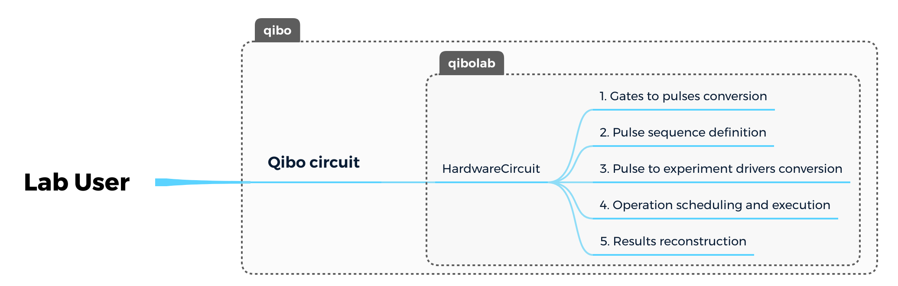
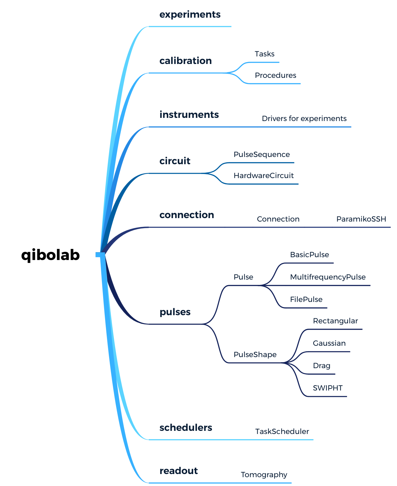

# qibolab software design doc

The main goal of this design doc is to make our effort more effective  by
forcing us to think through the design and gather feedback from others.

## Overview

qibolab is the dedicated [qibo](https://github.com/qiboteam/qibolab) backend for
the automatic deployment of quantum circuits on quantum hardware. This framework
is supposed to implement drivers and modules for instrument control, common
calibration procedures and real-time diagnostics tools.

## Context

Building and operating a quantum computing device is challenging. Typically,
laboratories implementing  quantum technologies require specific instruments and
firmwares to control the preparation, submission and execution of quantum
circuits in a classical laboratory server.

qibolab proposes for the first time an open-source solution for laboratories.

## Goals

The qibolab goals can be summarized as following:

- Execute qibo models in quantum hardware.
- Support multiple heterogeneous platforms.
- Support drivers for commercial instruments.
- Support drivers for custom instruments (e.g. FPGA).
- Provide tools for real-time diagnostics.
- Write good documentation for modules and provide tutorials about the inclusion
  of new platforms and instruments.

## Non-Goals

We should avoid as much as possible:

- Neglect good code development practices during development.
- Neglect a proper definition of tests and respective coverage.
- Hardcode laboratory specifics or adhoc solutions.

## Current layout

In the current qibolab layout delegates the execution of a user defined qibo
circuit through  the HardwareCircuit class and its execute method. The circuit
gates are converted into pulses which are send to the platform drivers after
appropriate conversion.

The results are then stored back in a format suitable for qibo operations.

The qibolab module is composed by multiple features. From pulse definition, instrument drivers, calibration procedures, operation scheduling and readout operations.

This layout should be adjusted and maintained in order to always accommodate
multiple quantum technologies.

## Milestones

### 2021

- First prototype for IcarusQ using AWG.
- First prototype for TIIq using QBlox instruments.

### 2022

- Support BCN hardware.
- Support CQT trapped-ion hardware.
- Make platform agnostic, provide plug and play mechanism to create and edit new platforms and instruments (e.g. WebApp).
- Cleanup and refactor code for publication.
- Support cloud interoperability and portability.
- Make the code public and synchronized with the qibo release plans.
- Support INFN hardware.
- Support UNIMIB hardware.
- First prototype for FPGA firmware.

### 2023 and beyond

- General maintenance.
- Support platform emulation.
- Support of novel instruments and platforms.
- Deployment of an agnostic FPGA firmware system.
- ...
