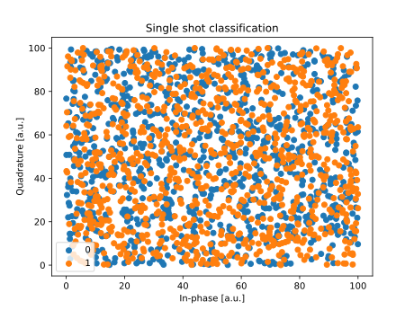

First experiment
================

The aim of this introductory example is to present the main aspects of the Qibolab
interface, bringing up all the required ingredients for an actual execution.

For configuration simplicity, a dummy instrument will be used. Since its only purpose is
to generate purely random numbers, respecting the layout.
At the end, the results will be compared with those resulting from a more comprehensive
:doc:`tutorial <../tutorials/emulator>`, based on the numerically computed evolution of
a :ref:`simulated system <main_doc_emulator>`.

Define the platform
-------------------

To launch experiments on quantum hardware, users have first to define their platform.

For a first experiment, let's define a single qubit platform.
In this example, the qubit is only coupled to a drive channel and a transmission line.
Where the latter is represented by a pair of related entities: an output probe channel,
and an input acquisition channel.

.. testcode:: python

    from qibolab import AcquisitionChannel, Hardware, IqChannel, Qubit
    from qibolab.instruments.dummy import DummyInstrument

    def create() -> Hardware:
        # Define qubit
        qubits = {0: Qubit.default(0)}

        # Create channels and connect to instrument ports
        channels = {}
        qubit = qubits[0]
        # Readout
        channels[qubit.probe] = IqChannel(mixer=None, lo=None)
        # Acquire
        channels[qubit.acquisition] = AcquisitionChannel(probe=qubit.probe, twpa_pump=None)
        # Drive
        channels[qubit.drive] = IqChannel(mixer=None, lo=None)

        # Define instruments
        controller = DummyInstrument(address="192.168.0.101:80", channels=channels)

        # Define and return platform
        return Hardware(instruments={"dummy": controller}, qubits=qubits)

And the we can define the following parameters (the exact content is not yet relevant,
and it will be explained in the :ref:`related section <main_doc_parameters>`).

.. collapse:: Parameters dictionary

    .. testcode:: python

        parameters = {
            "settings": {"nshots": 1000, "relaxation_time": 70000},
            "configs": {
                "dummy/bounds": {
                    "kind": "bounds",
                    "waveforms": 0,
                    "readout": 0,
                    "instructions": 0,
                },
                "0/drive": {"kind": "iq", "frequency": 4833726197},
                "0/probe": {"kind": "iq", "frequency": 7320000000},
                "0/acquisition": {
                    "kind": "acquisition",
                    "delay": 224,
                    "smearing": 0,
                    "threshold": 0.002100861788865835,
                    "iq_angle": -0.7669877581038627,
                },
            },
            "native_gates": {
                "single_qubit": {
                    "0": {
                        "RX": [
                            [
                                "0/drive",
                                {
                                    "kind": "pulse",
                                    "duration": 40,
                                    "amplitude": 0.5,
                                    "envelope": {"kind": "gaussian", "rel_sigma": 3.0},
                                },
                            ],
                        ],
                        "MZ": [
                            [
                                "0/acquisition",
                                {
                                    "kind": "readout",
                                    "acquisition": {
                                        "kind": "acquisition",
                                        "duration": 2000.0,
                                    },
                                    "probe": {
                                        "kind": "pulse",
                                        "duration": 2000.0,
                                        "amplitude": 0.003,
                                        "envelope": {"kind": "rectangular"},
                                    },
                                },
                            ]
                        ],
                    }
                },
                "two_qubit": {},
            },
        }

Finally, we can instantiate the defined platform as follows:

.. testcode:: python

    from qibolab import Platform, Parameters

    params = Parameters.model_validate(parameters)
    platform = Platform(name="my_platform", parameters=params, **vars(create()))

.. note::

    In this case, even defining ``create()`` and ``parameters`` separately appears
    redundant.
    However, this pattern is particularly convenient to separate the established devices
    arrangement, which is considered to be the fixed part of the platform, from the set
    of parameters, that are instead subject to calibration.

    The division is especially useful to store platforms as files. Qibolab also supplies
    built-in machinery to load these stored platforms, as described in the
    :doc:`../tutorials/storage` tutorial.

Further information about defining platforms is provided in the
:doc:`../main-documentation/platform` page, and several examples can be found at the
`TII QRC lab-dedicated repository <https://github.com/qiboteam/qibolab_platforms_qrc>`_.

Perform an experiment
---------------------

Once the platform is available, we can finally use it to execute an experiment.

One of the simplest options is a *single-shot classification*. It will make limited
usage of the available Experiment API, which will be explored in its :doc:`dedicated
guide <../main-documentation/experiment>`, or in further tutorials.

Here it is the required code:

.. testcode:: python

    import matplotlib.pyplot as plt

    from qibolab import AcquisitionType

    # access the native gates
    gates = platform.natives.single_qubit[0]

    results = []
    # iterate over pulse sequences
    for sequence in [gates.MZ(), gates.RX() | gates.MZ()]:
        # perform the experiment using specific options
        signal = platform.execute(
            [sequence],
            nshots=1000,
            acquisition_type=AcquisitionType.INTEGRATION,
        )
        _, acq = next(iter(sequence.acquisitions))

        # collect the results
        sig = signal[acq.id]
        results.append([sig[..., 0], sig[..., 1]])

    plt.title("Single shot classification")
    plt.xlabel("In-phase [a.u.]")
    plt.ylabel("Quadrature [a.u.]")

    plt.scatter(*results[0], label="0")
    plt.scatter(*results[1], label="1")
    plt.legend()

The main features of this snippet are:

- the calibrated *native gates* are accessed from the ``platform`` parameters
- they are used to construct a sequence (e.g. `gates.RX() | gates.MZ()`)
- the sequence is executed by the ``platform``
- the results consist of a dictionary, mapping the identifier of the acquisition
  operations to the arrays of results, which are organized over multiple dimensions
  (more in the :ref:`main_doc_results` section)

As announced from the beginning, the results are pure white noise:

This is because the platform we defined adopted a dummy instrument, which is mainly
provided for debugging purpose.

Using a more meaningful platform, e.g. one based on :doc:`QPU numerical simulation
<../tutorials/emulator>`, the result would have been the following

.. image:: ../tutorials/emulator-single-shot.svg
    :align: center
