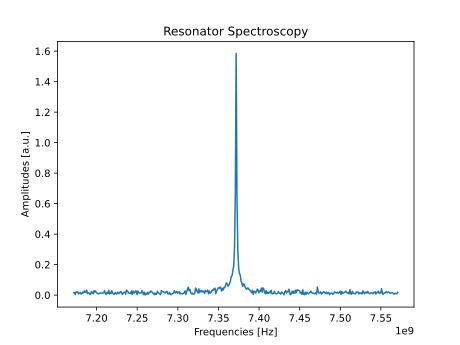
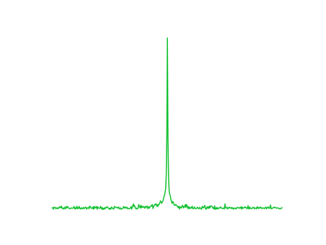

Performing the first experiment
===============================

Define the platform
-------------------

To launch experiments on quantum hardware, users have first to define their platform.
A platform is composed of a python file, with instruments information, and of a runcard file, with calibration parameters.
More information about defining platforms is provided in :doc:`../tutorials/lab` and several examples can be found at `TII dedicated repository <https://github.com/qiboteam/qibolab_platforms_qrc>`_.

For a first experiment, let's define a single qubit platform at the path previously specified.
For simplicity, the qubit will be controlled by a RFSoC-based system, althought minimal changes are needed to use other devices.

.. code-block:: python

    # my_platform.py

    import pathlib

    from qibolab.channels import Channel, ChannelMap
    from qibolab.instruments.rfsoc import RFSoC
    from qibolab.instruments.rohde_schwarz import SGS100A as LocalOscillator
    from qibolab.platform import Platform
    from qibolab.serialize import load_qubits, load_runcard, load_settings

    NAME = "my_platform"  # name of the platform
    ADDRESS = "192.168.0.1"  # ip adress of the controller
    PORT = 6000  # port of the controller

    # path to runcard file with calibration parameter
    RUNCARD = pathlib.Path(__file__).parent / "my_platform.yml"

    def create(runcard_path=RUNCARD):
        # Instantiate controller instruments
        controller = RFSoC(NAME, ADDRESS, PORT)

        # Create channel objects and port assignment
        channels = ChannelMap()
        channels |= Channel("readout", port=controller[1])
        channels |= Channel("feedback", port=controller[0])
        channels |= Channel("drive", port=controller[0])

        # create qubit objects
        runcard = load_runcard(runcard_path)
        qubits, pairs = load_qubits(runcard)
        # assign channels to qubits
        qubits[0].readout = channels["L3-22_ro"]
        qubits[0].feedback = channels["L1-2-RO"]
        qubits[0].drive = channels["L3-22_qd"]

        instruments = {controller.name: controller}
        settings = load_settings(runcard)
        return Platform(NAME, qubits, pairs, instruments, settings, resonator_type="3D")

And the we can define the runcard:

.. code-block:: yaml

    # my_platform.yml

    nqubits: 1
    qubits: [0]
    topology: []
    settings: {nshots: 1024, relaxation_time: 70000, sampling_rate: 9830400000}

    native_gates:
        single_qubit:
            0:
                RX:  # pi-pulse for X gate
                    duration: 40
                    amplitude: 0.5
                    frequency: 5_500_000_000
                    shape: Gaussian(3)
                    type: qd
                    start: 0
                    phase: 0

                MZ:  # measurement pulse
                    duration: 2000
                    amplitude: 0.02
                    frequency: 7_370_000_000
                    shape: Rectangular()
                    type: ro
                    start: 0
                    phase: 0

        two_qubits: {}
    characterization:
        single_qubit:
            0:
                readout_frequency: 7370000000
                drive_frequency: 5500000000
                anharmonicity: 0
                Ec: 0
                Ej: 0
                g: 0
                T1: 0.0
                T2: 0.0
                threshold: 0.0
                iq_angle: 0.0
                mean_gnd_states: [0.0, 0.0]
                mean_exc_states: [0.0, 0.0]

Setting up the environment
--------------------------

After defining the platform, we must instruct ``qibolab`` of the location of the create file.
This can be done using an environment variable.
for Unix based systems:

.. code-block:: bash

    export QIBOLAB_PLATFORMS=<path-to-create-file>

for Windows:

.. code-block:: bash

    $env:QIBOLAB_PLATFORMS="<path-to-create-file>"

To avoid having to repeat this export command for every session, this line can be added to the ``.bashrc`` file (or alternatives as ``.zshrc``).

Run the experiment
------------------

Let's take the `Resonator spectroscopy experiment` defined and detailed in :doc:`../tutorials/calibration`.
Since it is a rather simple experiment, it can be used to perform a fast sanity-check on the platform.

We leave to the dedicated tutorial a full explanation of the experiment, but here it is the required code:

.. code-block:: python

    import numpy as np
    import matplotlib.pyplot as plt

    from qibolab import create_platform
    from qibolab.pulses import PulseSequence
    from qibolab.sweeper import Sweeper, SweeperType, Parameter
    from qibolab.execution_parameters import (
        ExecutionParameters,
        AveragingMode,
        AcquisitionType,
    )

    # load the platform from ``my_platform.py`` and ``my_platform.yml``
    platform = create_platform("my_platform")

    # define the pulse sequence
    sequence = PulseSequence()
    ro_pulse = platform.create_MZ_pulse(qubit=0, start=0)
    sequence.add(ro_pulse)

    # define a sweeper for a frequency scan
    sweeper = Sweeper(
        parameter=Parameter.frequency,
        values=np.arange(-2e8, +2e8, 1e6),
        pulses=[ro_pulse],
        type=SweeperType.OFFSET,
    )

    # perform the experiment using specific options
    options = ExecutionParameters(
        nshots=1000,
        relaxation_time=50,
        averaging_mode=AveragingMode.CYCLIC,
        acquisition_type=AcquisitionType.INTEGRATION,
    )

    results = platform.sweep(sequence, options, sweeper)

    # plot the results
    amplitudes = results[ro_pulse.serial].magnitude
    frequencies = np.arange(-2e8, +2e8, 1e6) + ro_pulse.frequency

    plt.title("Resonator Spectroscopy")
    plt.xlabel("Frequencies [Hz]")
    plt.ylabel("Amplitudes [a.u.]")

    plt.plot(frequencies, plt.amplitudes)

