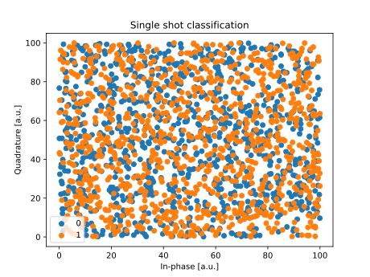

.. _first_experiment:

Your first pulse experiment
===========================

An experiment in Qibolab starts with a platform, a pulse sequence, and a choice of
how to acquire the results. This tutorial introduces that workflow without connecting
to laboratory equipment. You will prepare two sequences, execute them together,
and retrieve the integrated I/Q samples for each measurement.

We use the built-in ``dummy`` platform. It has channels and native pulse definitions,
but returns random data rather than simulating a quantum system. This makes it useful
for learning the interface and checking the structure of an experiment. It cannot
tell you whether a pulse prepares the desired state. The
:ref:`emulation tutorial <tutorials_emulator>` takes the next step toward a
physical simulation.

Load a platform
---------------

After :ref:`installing Qibolab <installing-qibolab>`, start a Python session:

.. testcode::

    from qibolab import AcquisitionType, AveragingMode, create_platform

    platform = create_platform("dummy")
    qubit_id = 0
    qubit = platform.qubits[qubit_id]
    natives = platform.natives.single_qubit[qubit_id]

No platform files or environment variables are needed for ``dummy``. For a laboratory
platform, ``create_platform`` instead loads your local definition and its calibration
parameters; see :ref:`platform storage <main_doc_storage>`.

The ``qubit`` object identifies the channels used to control and measure qubit 0.
The ``natives`` object holds the pulse sequences assigned to its native operations.
In this example, ``RX`` represents a calibrated pi rotation and ``MZ`` a measurement.
The dummy definitions are only examples, not a calibration for your device.

Prepare two sequences
---------------------

A common readout experiment compares measurements with and without an excitation
pulse. Calling a native operation creates a new sequence with fresh instruction
identifiers:

.. testcode::

    ground = natives.MZ()
    excited = natives.RX() | natives.MZ()
    sequences = [ground, excited]

The ``|`` operator places the measurement after the rotation, synchronizing the
channels involved in the two sequences. This matters because the drive and
acquisition channels have independent timelines: merely listing a drive pulse
before a measurement does not establish an ordering between different channels.
The :ref:`experiment guide <main_doc_experiment>` explains the timing model.

Keep these sequence objects. The identifiers of their acquisitions are the keys
you will use to retrieve the results. Do not call ``MZ()`` again to look up the
measurement: that would create a different acquisition.

Execute and retrieve the samples
--------------------------------

For single-shot I/Q data, explicitly request integration without averaging.
On a physical platform, integration demodulates and integrates the acquired
waveform, returning an in-phase and a quadrature value for each shot.

.. testcode::

    platform.connect()
    try:
        results = platform.execute(
            sequences,
            nshots=128,
            acquisition_type=AcquisitionType.INTEGRATION,
            averaging_mode=AveragingMode.SINGLESHOT,
        )
    finally:
        platform.disconnect()

    ground_id = ground.acquisitions[0][1].id
    excited_id = excited.acquisitions[0][1].id
    ground_iq = results[ground_id]
    excited_iq = results[excited_id]

    assert ground_iq.shape == (128, 2)
    assert excited_iq.shape == (128, 2)

Connection and disconnection belong around the execution, not around sequence
construction. The ``finally`` block releases connections even if execution fails.
You can keep a platform connected for several executions in a longer experiment.

The return value is a dictionary, not a list ordered by qubit or by sequence.
Each acquisition maps to its own NumPy array. Here the first axis indexes shots,
and the last axis contains I and Q, in that order:

.. testcode::

    ground_i = ground_iq[:, 0]
    ground_q = ground_iq[:, 1]
    excited_i = excited_iq[:, 0]
    excited_q = excited_iq[:, 1]

The platform supplies the default relaxation time between repetitions, while
the explicit ``nshots`` above overrides its default shot count. Times in the pulse
API and ``relaxation_time`` are expressed in nanoseconds.

Interpret the result
--------------------

On a calibrated device, plotting the two sets of points in the I/Q plane can
reveal whether the readout distinguishes the ground and excited states. If you
have Matplotlib installed, you can visualize the arrays as follows:

.. code-block:: python

    import matplotlib.pyplot as plt

    plt.scatter(ground_i, ground_q, label="Without RX", alpha=0.5)
    plt.scatter(excited_i, excited_q, label="With RX", alpha=0.5)
    plt.xlabel("I [a.u.]")
    plt.ylabel("Q [a.u.]")
    plt.legend()
    plt.show()

For ``dummy``, both sets are random and should not be interpreted as evidence
of state preparation or readout fidelity. The following illustration shows the
kind of unstructured data to expect, not a reproducible numerical result:

You now have the complete execution workflow. Continue with
:doc:`../tutorials/pulses` to construct your own instructions, or
:doc:`../tutorials/sweeps` to vary a parameter within one experiment. For a physical
readout comparison, use :doc:`../tutorials/emulator` or a calibrated laboratory
platform.
