Installation instructions
=========================

.. _installing-qibolab:

Qibolab
^^^^^^^
Installing with pip
"""""""""""""""""""

The installation using ``pip`` is the recommended approach to use Qibolab.
After updating ``pip``, if needed, install Qibolab with:

.. code-block:: bash

   pip install qibolab

.. note::

    Remember that Qibolab is compatible with Pyhon >= 3.9 and < 3.12.

Installing with conda
"""""""""""""""""""""

We provide conda packages for ``qibolab`` through the `conda-forge
<https://anaconda.org/conda-forge>`_ channel.

To install the package with conda run:

.. code-block:: bash

      conda install -c conda-forge qibolab

Installing from source
""""""""""""""""""""""

It is possible to install Qibolab from source, althought it is not recommended if not strictly required.

In order to install ``qibolab`` from source, you have to clone the GitHub repository with:

.. code-block:: bash

      git clone https://github.com/qiboteam/qibolab.git
      cd qibolab

Then, to install the package in standard mode (recommended if no changes on the source code are needed) one can still use ``pip``:

.. code-block:: bash

      pip install . # or pip install -e .

For developers, in order to modify the source code, it is possible to install using ``poetry`` or ``pip``:

.. code-block:: bash

      poetry install    # recommended
      pip install -e .  # not recommended

_______________________

.. _Instruments:

Supported instruments
^^^^^^^^^^^^^^^^^^^^^

Qibolab supports the following control instruments:

* Quantum Machines
* Zurich Instruments
* QBlox
* Xilinx RFSoCs

In order to use Qibolab on with one of these instruments chosen instrument,
additional dependencies need to be installed.
This can be done with:

.. code-block:: bash

      # for installation from releases
      pip install qibolab[qm,zh,qblox,rfsoc]

      # or for installation from source
      poetry install -E qm -E zh -E qblox -E rfsoc

Or with conda

.. code-block:: bash

      conda install -c conda-forge qibolab[qm,zh,qblox,rfsoc]

With the extras being:

* Quantum Machines -> ``qm``
* Zurich Instruments -> ``zh``
* QBlox -> ``qblox``
* Xilinx RFSoCs -> ``rfsoc``

.. note::

   Installing all the extras is usually not needed.
   It is possible to install qibolab with any number of extras.
