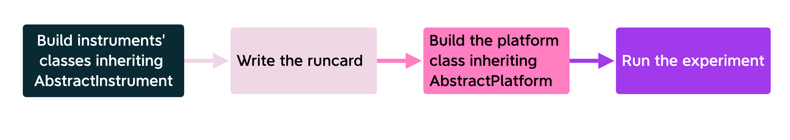

How to connect Qibolab to your lab
==================================

In this section we will show how to let ``Qibolab`` communicate with your lab’s instruments and run an experiment.
``Qibolab`` has an abstract class `AbstractInstrument <https://github.com/qiboteam/qibolab/blob/main/src/qibolab/instruments/abstract.py>`_
with some abstract methods such as ``start``, ``stop``, ``connect``.
In order to set up one instrument, you have to build a child class and implement the methods you need.
Here we implemented an easy instrument class (``DummyInstrument``) as a little example.

.. code-block:: python

    from qibolab.platforms.abstract import AbstractPlatform
    from qibolab.instruments.abstract import AbstractInstrument
    import yaml
    import numpy as np
    from qibo.config import log, raise_error
    import time
    from qibolab.pulses import Pulse, ReadoutPulse, PulseSequence

    class DummyInstrument(AbstractInstrument):

            def __init__(self):
                pass

            def start(self):
                # Insert code to turn on the instrument
                pass

            def stop (self):
                # Insert code to stop the instrument
                pass

            def connect(self):
                # Insert code to connect the instrument
                pass

            def disconnect(self):
                # Insert code to disconnect the instrument
                pass

            def setup(self):
                # Insert code to set up the instrument
                pass

            def set_device_parameter(self, *args, **kwargs):
                # Insert code to set up the instrument's parameters
                pass

After all the devices have a proper class, they have to be coordinated to perform an experiment.
In ``Qibolab`` we can do this with a class (``DummyPlatform``) that inherits the methods
from ``AbstractPlatform`` and reads the useful information from the runcard below
(in this example we save it as ``dummy.yml``):

.. code-block:: yaml

    nqubits: 1
    description: Dummy platform runcard to use for testing.
    # Instruments' settings
    settings:
        hardware_avg: 1024
        sampling_rate: 1_000_000_000
        repetition_duration: 200_000
        minimum_delay_between_instructions: 4
    # time to sleep every time ``execute_pulse_sequence`` is called
    sleep_time: 1
    # list of qubits' IDs
    qubits: [0]
    # Qubits' properties
    characterization:
        single_qubit:
            0:
                resonator_freq: 7824855425
                qubit_freq: 5082441303
                T1: 21160
                T2: 17214
                state0_voltage: 847
                state1_voltage: 251
                mean_gnd_states: (-0.0008313786783245074+0.00044815319987281076j)
                mean_exc_states: (-0.00022773024569023835+0.0003203066357136082j)

The class ``DummyPlatform`` has a method ``execute_pulse_sequence`` that executes the
input pulse sequences and return an output pulse sequence.

.. code-block:: python

    class DummyPlatform(AbstractPlatform):
        #Dummy platform that returns random voltage values.
        #Args:
        #   name (str): name of the platform.
        #   runcard (str): path to the runcard
        def __init__(self, name, runcard):
            self.name = name
            self.runcard = runcard
            self.is_connected = False
            # Load platform settings
            with open(runcard) as file:
                self.settings = yaml.safe_load(file)
            # create dummy instruments
            nqubits = self.settings.get("nqubits")
            self.qcm = {i: DummyInstrument() for i in range(nqubits)}
            self.qrm = {i: DummyInstrument() for i in range(nqubits)}

        def reload_settings(self):
            log.info("Dummy platform does not support setting reloading.")

        def run_calibration(self, show_plots=False):
            raise_error(NotImplementedError)

        def connect(self):
            log.info("Connecting to dummy platform.")

        def setup(self):
            log.info("Setting up dummy platform.")

        def start(self):
            log.info("Starting dummy platform.")

        def stop(self):
            log.info("Stopping dummy platform.")

        def disconnect(self):
            log.info("Disconnecting dummy platform.")

        def to_sequence(self, sequence, gate):
            raise_error(NotImplementedError)

        def execute_pulse_sequence(self, sequence, nshots=None):
            time.sleep(self.settings.get("sleep_time"))
            ro_pulses = {pulse.qubit: pulse.serial for pulse in sequence.ro_pulses}
            results = {}
            for qubit, pulse in ro_pulses.items():
                i, q = np.random.random(2)
                results[qubit] = {pulse: (np.sqrt(i**2 + q**2), np.arctan2(q, i), i, q)}
            return results

To start the experiment, simply initialize the platform and launch the desired method.

.. code-block:: python

    platform = DummyPlatform("dummy","path/to/dummy.yml")
    sequence = PulseSequence()

    # Add some pulses to the pulse sequence

    sequence.add(
        ReadoutPulse(
            start=4004,
            amplitude=0.9,
            duration=2000,
            frequency=20_000_000,
            relative_phase=0,
            shape="Rectangular",
            channel=2,
            qubit=0,
        )
    )

    output = platform.execute_pulse_sequence(sequence)
    print(output)

The diagram below summmarises the workflow followed in this example to run an experiment.

