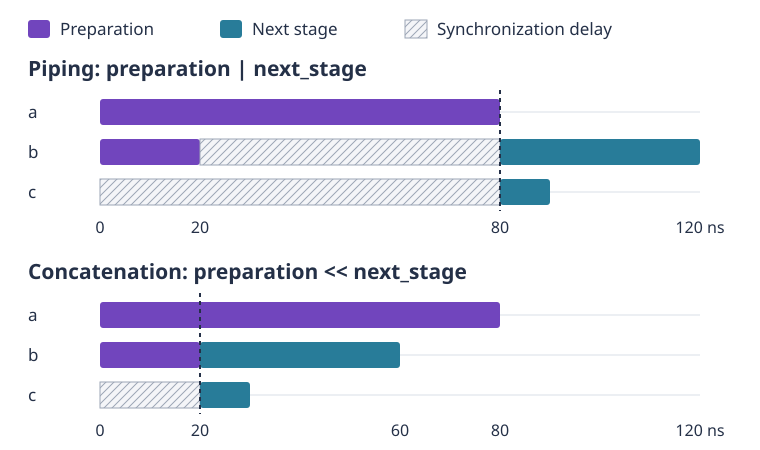

.. _main_doc_experiment:

Experiments with pulses
=======================

A pulse-level experiment describes what the control electronics should do,
when they should do it, and which measurements should be returned. Unlike a
gate circuit, it exposes the duration and shape of each control operation.
This is useful when measuring a relaxation time, calibrating a rotation, or
testing a waveform that is not yet part of the platform's native gates.

Three pieces work together. A :class:`qibolab.PulseSequence` schedules
instructions on named channels; the platform supplies the channel
configuration and calibrated native operations; execution options specify
repetitions and acquisition. Optional sweepers repeat the same schedule with
different parameter values. Keeping these pieces separate lets you change a
frequency scan without rebuilding a waveform, or change the acquisition mode
without rewriting the experiment.

This guide explains that model. For a complete first experiment, follow
:ref:`tutorials_pulses`; for scans and their data axes, continue with
:ref:`tutorials_sweeps`. The examples here use ``create_platform("dummy")``
and require no laboratory connection. The dummy platform returns random
arrays with the expected result layout: it is **not a physical simulation**
of qubits, resonators, or the effect of the pulses.

Waveforms are not schedules
---------------------------

A :class:`qibolab.Pulse` specifies a duration, a digital amplitude, an
envelope, and an optional relative phase. Durations are in **nanoseconds**,
phases in **radians**, and digital amplitudes are dimensionless, normalized
to the range ``[-1, 1]``. An amplitude is not a voltage or a rotation angle:
its physical effect depends on the channel and its calibration.

.. testcode:: experiment

    from qibolab import Gaussian, Pulse

    drive_pulse = Pulse(
        duration=40,
        amplitude=0.2,
        envelope=Gaussian(rel_sigma=0.2),
        relative_phase=0.0,
    )
    assert drive_pulse.duration == 40

The Gaussian's ``rel_sigma`` is a fraction of the pulse duration, not a
time in nanoseconds: this pulse has a nominal standard deviation of
``0.2 * 40 = 8`` ns. Envelopes supply in-phase and quadrature waveforms.
For example, a Gaussian has a zero quadrature envelope, whereas DRAG
adds a derivative-shaped quadrature component. The envelope library is
described by the API reference; choosing a shape does not in itself
calibrate a gate.

Frequency is deliberately absent from the ordinary pulse fields. The
configured carrier frequency belongs to the channel and is expressed in
**hertz**. Thus ``platform.config(qubit.drive).frequency`` is a frequency
in Hz, and a frequency sweeper supplies values in Hz. Waveform sampling
uses a different convention: sampling rates are in GS/s, numerically
equivalent to samples/ns. ``pulse.envelopes(rate)`` returns a ``(2, N)``
array with ``N = int(pulse.duration * rate)``. These are amplitude-scaled
envelopes, not the final carrier-modulated output; the relative phase is
not applied by this sampling method.

Not every instruction emits a waveform. A ``Delay`` advances one channel's
clock without output. A ``VirtualZ`` changes the drive-channel phase frame
and has zero duration. An ``Acquisition`` requests data on an acquisition
channel. A ``Readout`` combines a probe pulse with an acquisition and is
placed on the acquisition channel; the platform associates it with the
corresponding probe channel. Its sequence duration is its acquisition
duration plus its ``time_of_flight``, in ns. Using a calibrated native
measurement is normally preferable to constructing this timing yourself.

Each channel has its own clock
------------------------------

A sequence is an ordered collection of ``(channel, instruction)`` pairs.
Instructions on the **same** channel play consecutively. Different
channels advance independently and can play simultaneously, regardless
of where their entries appear in the collection. The sequence duration is
the longest channel duration, not the sum of all instructions.

This distinction matters when preparing a qubit and then measuring it.
Simply appending a measurement on a different channel does not make it
wait for the drive pulse. Use an alignment boundary when one stage must
finish before another starts.

.. testcode:: experiment

    from qibolab import Delay, PulseSequence

    preparation = PulseSequence(
        [
            ("a", Delay(duration=80)),
            ("b", Delay(duration=20)),
        ]
    )
    next_stage = PulseSequence(
        [
            ("b", Delay(duration=40)),
            ("c", Delay(duration=10)),
        ]
    )
    piped = preparation | next_stage
    concatenated = preparation << next_stage
    assert preparation.duration == 80
    assert piped.channel_duration("b") == 120
    assert piped.channel_duration("c") == 90
    assert concatenated.channel_duration("b") == 60
    assert concatenated.channel_duration("c") == 30
    assert concatenated.duration == 80

Here the channel names are just a timing illustration, not channels to
execute on a platform. The ``|`` operator inserts an ``Align`` boundary
on the union of both sequences' channels. Everything in the right-hand
stage therefore starts after the left-hand stage ends: at 80 ns in this
example. ``|=`` performs the same operation in place.

The ``<<`` operator has a more local meaning. It synchronizes only the
channels used by the right-hand sequence, at their latest time in the
left-hand sequence. Here ``b`` is at 20 ns and the new channel ``c`` at
zero, so the right-hand stage starts at 20 ns while ``a`` is still
running. ``<<=`` and ``concatenate`` are its in-place forms. Use this
behavior deliberately when stages are allowed to overlap; it is not a
substitute for a global boundary.

    The example above on independent channel clocks. Piping (``|``) waits for
    the whole preparation; concatenation (``<<``) waits only for the channels
    used by the next stage. Hatched intervals are synchronization delays.

Ordinary ``append``, ``extend``, and list-like ``+`` add entries without
inserting synchronization. For a boundary between selected channels,
``sequence.align(channels)`` adds a shared ``Align`` instruction to them.
``align_to_delays()`` returns an equivalent schedule with explicit delays
instead of alignment markers, useful when inspecting timing. It does not
modify the original. Similarly, ``trim()`` removes trailing delays in a
new sequence; do not trim an idle interval that is part of the experiment.

Native operations and measurement identity
------------------------------------------

The native operations in ``platform.natives`` are calibrated sequence
factories, rather than instructions to reuse directly. Calling ``RX()``
or ``MZ()`` creates a fresh sequence with fresh instruction identifiers;
``create_sequence()`` is the equivalent explicit spelling. This preserves
the calibrated parameters without reusing the identity of a previous
measurement. Native availability depends on the platform.

.. testcode:: experiment

    from qibolab import AcquisitionType, AveragingMode, create_platform

    platform = create_platform("dummy")
    natives = platform.natives.single_qubit[0]
    measurement = natives.MZ()
    sequence = natives.RX() | measurement
    readout = measurement.acquisitions[0][1]

    another_measurement = natives.MZ()
    assert readout.id != another_measurement.acquisitions[0][1].id

    platform.connect()
    try:
        results = platform.execute(
            [sequence],
            nshots=8,
            relaxation_time=100,
            acquisition_type=AcquisitionType.INTEGRATION,
            averaging_mode=AveragingMode.SINGLESHOT,
        )
    finally:
        platform.disconnect()

    assert set(results) == {readout.id}
    assert results[readout.id].shape == (8, 2)

Save the measurement that actually went into the experiment. Calling
``MZ()`` again afterwards creates a different identifier and cannot locate
the earlier result. ``sequence.acquisitions`` finds both ``Acquisition``
and ``Readout`` events, excluding delays on acquisition channels. A
``Readout``'s public ``id`` is its nested acquisition's identifier.

Sequence composition and shallow copies preserve instruction identities;
they do not create fresh measurements. All acquisition identifiers must
be unique within one call to ``execute``, including across different
sequences. Consequently, passing ``[sequence, sequence.copy()]`` when it
contains a measurement raises an error. Build independent alternatives
with separate native factory calls, or use an instruction's ``new()``
method when deliberately cloning it with a fresh identity.

Choosing what to acquire
------------------------

``platform.execute`` takes a **list of sequences**, an optional grouped
list of sweepers, and keyword execution options. Multiple sequences are
independent experiments, not implicitly concatenated stages. The platform
may batch their execution, but measurements are still returned separately
by identifier. Sequence channels must exist on the selected platform:
obtain them from ``platform.qubits`` rather than assuming names from a
different laboratory.

``nshots`` controls repetitions; ``relaxation_time`` is the wait between
repetitions in ns. Omitting either, or passing ``None``, uses
``platform.settings``. A short wait is convenient for dummy examples but
does not establish a suitable reset time for real qubits.
``fast_reset=True`` requests an alternative reset mechanism only where
supported. On hardware, connect before execution and always disconnect
afterwards, including when an exception occurs.

Acquisition determines the information retained. ``DISCRIMINATION``
returns state labels for individual shots, using the platform's readout
calibration. ``INTEGRATION`` returns a demodulated, integrated I/Q pair.
``RAW`` retains a sampled waveform rather than reducing it to one I/Q
pair. Do not assume raw data are already demodulated, or that their
normalization is a universal voltage scale.

Averaging determines whether individual repetitions remain accessible.
``SINGLESHOT`` retains the shot axis. ``CYCLIC`` and ``SEQUENTIAL`` average
it away. Conceptually, cyclic averaging revisits the whole scan for each
repetition, whereas sequential averaging completes the repetitions at
one scan point before advancing. Cyclic averaging can reduce bias from
slow drift. These modes have the same output shape but different
acquisition ordering; the selected hardware must support the requested
combination. Averaged binary discrimination produces population
estimates rather than individual 0/1 outcomes.

For a one-off change to channel configuration, the ``updates`` execution
option accepts a list of component-name-to-property mappings. They are
applied on top of the platform configuration for that execution, with
later entries taking precedence, without replacing the stored platform
parameters. A scan over many values is instead a job for sweepers.

.. _main_doc_results:

Reading the result arrays
-------------------------

The result dictionary maps each acquisition identifier to a NumPy array.
It does not have a leading sequence or qubit axis: several readouts mean
several dictionary entries. This makes the retained readout object, or
``sequence.acquisitions``, the reliable route from an experiment to its
data.

Without sweeps, the shapes are:

.. list-table::
   :header-rows: 1
   :widths: 30 35 35

   * - Acquisition
     - ``SINGLESHOT``
     - ``CYCLIC`` or ``SEQUENTIAL``
   * - ``DISCRIMINATION``
     - ``(nshots,)``
     - ``()`` (a scalar array)
   * - ``INTEGRATION``
     - ``(nshots, 2)``
     - ``(2,)``
   * - ``RAW``
     - ``(nshots, samples, 2)``
     - ``(samples, 2)``

The final length-two axis holds I and Q, in that order. ``samples`` is
the number of acquired time samples for that readout, determined by
acquisition duration and the platform's acquisition sampling behavior.
It is not the drive-pulse duration, and need not be identical for
different readouts.

A sweep adds one axis per **group** of sweepers, between the optional
shot axis and the acquisition axes. If the group lengths are ``L0`` and
``L1``, single-shot integration has shape ``(nshots, L0, L1, 2)`` and
averaged integration has shape ``(L0, L1, 2)``. Single-shot
discrimination is ``(nshots, L0, L1)``; averaged raw acquisition is
``(L0, L1, samples, 2)``. ``ExecutionParameters.results_shape`` expresses
this rule when given concrete ``nshots`` and, for raw acquisition, the
sample count.

Sweepers in one group advance together in a zip-like traversal; separate
groups define nested loops, with the first group outermost. Two
sweepers in one group therefore do **not** create a two-dimensional
grid. The :ref:`sweep tutorial <tutorials_sweeps>` demonstrates both
arrangements, including how to index their results.

From a valid schedule to a valid hardware experiment
----------------------------------------------------

The Python model describes the intended experiment, not all the
constraints of a particular control system. Hardware may restrict timing
resolution, waveform length, amplitude and frequency ranges, acquisition
windows, the number of measurements, supported sweep parameters, or the
combination of acquisition and averaging modes. A duration sweep can
also change when later instructions start, so a fixed alignment strategy
needs to remain meaningful over the whole scan.

Check the platform's calibrated configuration and supported capabilities
before executing a new experiment. A successful dummy execution verifies
API use and array layout, not physical feasibility or experimental
correctness. In particular, no contrast, oscillation, or decay inferred
from dummy random values is a prediction about the proposed experiment.
