Elements description
====================

In this section, we provide a basic description of the main elements in
``qibolab``. The purpose of this part of the documentation is not to provide a
complete overview of the code, for that we suggest to refer to the api-reference
section, but rather to help a new user to gain a basic understanding of all the
elements.

.. toctree::
    :caption: Main elements
    :maxdepth: 3

    qibolab
