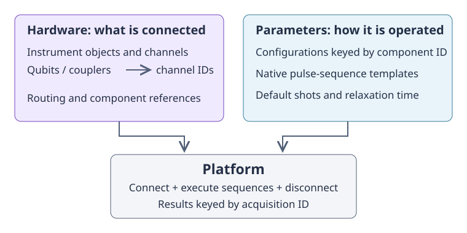

.. _main_doc_platform:

Platforms
=========

A :class:`qibolab.Platform` brings together a device's wiring, its operating
parameters, and the instruments needed to execute pulse sequences. It is the
entry point for pulse experiments through :meth:`qibolab.Platform.execute`, and
also supplies the native operations used when compiling circuits. The same
experiment can therefore be expressed independently of the particular laboratory
that runs it, provided that its channels and required operations exist there.

There are two complementary parts to a platform. :class:`qibolab.Hardware`
describes *what is connected*: instrument objects and mappings of qubits and
couplers to channels. :class:`qibolab.Parameters` describes *how it is operated*:
component configurations, native pulse sequences, and default execution
settings. A ``Platform`` combines these parts with a name and manages execution
and connections. ``Hardware`` alone has neither calibrated pulse definitions nor
an execution method; a parameters file alone cannot reconstruct the instruments.

    Wiring and operating parameters are separate inputs to a platform.
    Channel identifiers link the wiring to its configurations.

The :ref:`platform construction tutorial <tutorial_platform>` demonstrates this
composition without depending on a particular laboratory integration.
:ref:`main_doc_storage` explains how to persist the parameters and discover
platform definitions.

Hardware, qubits, and channels
------------------------------

``Hardware.instruments`` maps instrument identifiers to existing instrument
objects supplied by an integration. ``Hardware.qubits`` maps physical qubit
identifiers to :class:`qibolab.Qubit` objects. ``Hardware.couplers`` is an
optional, separate mapping of coupler identifiers to the same kind of object.
These mappings describe the laboratory topology rather than a calibration.
``Platform`` exposes the corresponding mappings directly.

A ``Qubit`` is a convenient collection of **channel identifiers**, not a
collection of channel objects. Its ``drive`` identifies the line used to drive
the qubit, ``flux`` identifies a tuning line, ``probe`` identifies the readout
excitation, and ``acquisition`` identifies the input used to collect the
measurement. These fields are optional: for example, a fixed-frequency qubit
need not have a flux line. ``drive_extra`` is a mapping for additional channels,
including transitions such as ``(1, 2)`` or drives associated with another qubit.
A coupler is usually represented by a ``Qubit`` with only its flux field set.

``Qubit.default(name)`` generates conventional identifiers such as
``"q0/drive"``; it does not declare channels on an instrument. Likewise,
``Qubit.coupler(name)`` generates ``"coupler_<name>/flux"`` without allocating
hardware. Declaring a qubit and making the referenced channels available are
separate responsibilities.

Channel objects belong to the controlling instrument's channel mapping.
``Platform.channels`` gathers those mappings into a dictionary keyed by channel
identifier. A :class:`qibolab.Channel` describes routing through ``device`` and
``path``; the meaning of these addresses is supplied by the integration.
:class:`qibolab.DcChannel` represents an unmodulated output and
:class:`qibolab.IqChannel` a modulated output. An IQ channel can refer to a local
oscillator and mixer by their component identifiers.
:class:`qibolab.AcquisitionChannel` represents an input and can refer to its
associated probe channel and a pump component.

Two channels can share a physical output or a local oscillator. This is why a
channel stores routing and references, while the adjustable values live in a
separate configuration database. Changing a shared component's configuration
affects all channels referring to that component, not just the qubit from which
the component was found.

For example, the built-in dummy platform can be inspected without opening a
hardware connection:

.. doctest:: platform-model

    >>> from qibolab import create_platform
    >>> platform = create_platform("dummy")
    >>> qubit = platform.qubits[0]
    >>> qubit.drive
    '0/drive'
    >>> qubit.drive in platform.channels
    True
    >>> platform.qubit_channels[qubit.drive]
    0
    >>> platform.config(qubit.drive).kind
    'iq'

Here ``0`` is a qubit identifier, whereas ``"0/drive"`` is a channel identifier
and also the key of that channel's configuration. A configuration is not what
declares the channel: adding a key to ``parameters.configs`` does not make a new
output available to a sequence.

.. _main_doc_parameters:

Operating parameters
--------------------

``platform.parameters`` is a serializable ``Parameters`` model with three
sections. They have different roles and should not be treated as interchangeable.

Component configurations
^^^^^^^^^^^^^^^^^^^^^^^^

``parameters.configs`` maps component identifiers to :class:`qibolab.Config`
subclasses. ``platform.config(identifier)`` retrieves an entry, and
``platform.components`` gives the set of configured identifiers. This set can
include more than ``platform.channels``: oscillators and mixers, for example,
are configurable components without being sequence channels.

An :class:`qibolab.IqConfig` holds the channel's carrier frequency and its
frequency-dependent IQ corrections, ``scale_q`` and ``phase_q``.
:class:`qibolab.DcConfig` holds a bias offset and optional filters.
:class:`qibolab.AcquisitionConfig` holds acquisition timing and optional
discrimination or integration parameters, such as ``threshold``, ``iq_angle``,
and ``kernel``. A :class:`qibolab.OscillatorConfig` holds an oscillator's
frequency and power, while :class:`qibolab.MixerOffsetConfig` holds per-component
IQ offsets for suppressing LO leakage.

These values configure the preparation of an execution. They are distinct from
the precisely scheduled instructions inside a :class:`qibolab.PulseSequence`.
For example, an IQ configuration supplies a carrier frequency, while a pulse
supplies an envelope, duration, amplitude, and relative phase. If a configuration
key also names an entry in ``platform.instruments``, execution applies that
configuration to the corresponding instrument before playing the sequences.

Native operations
^^^^^^^^^^^^^^^^^

``parameters.native_gates``, also available as ``platform.natives``, contains
``single_qubit``, ``coupler``, and ``two_qubit`` mappings. Their keys identify
qubits, couplers, and qubit pairs respectively. Entries hold pulse-sequence
templates for native operations such as ``RX``, ``RX90``, ``RX12``, ``MZ``,
``CZ``, ``CNOT``, or ``iSWAP``. Not every platform defines every operation;
an absent operation has value ``None``.

A native's ``create_sequence()`` (or calling the native directly) makes a
sequence with fresh instruction identifiers. This is important for measurements:
each acquisition in a batch must have a unique identifier so that results do
not overwrite one another. Native definitions are reusable templates, not
measurement results or promises that an operation has been calibrated.

``platform.pairs`` lists pairs present in the two-qubit native mapping; it does
not infer connectivity from the wiring. Pairs are ordered tuples. Reverse
lookup is supported only when the registered operations for the pair are
symmetric; a directional operation such as ``CNOT`` cannot be assumed to exist
in both directions.

Default settings
^^^^^^^^^^^^^^^^

``parameters.settings``, also available as ``platform.settings``, holds the
default ``nshots`` and ``relaxation_time``. A newly constructed default
``Parameters`` uses 1000 shots and a relaxation time of 100000 ns, but a loaded
platform can have different defaults.

Execution keyword arguments override these defaults for a single call.
Acquisition type and averaging mode are execution options, not fields of
``Settings``. By default an execution requests discrimination results without
averaging; explicitly selecting options is preferable when an experiment needs
another result format. See :ref:`main_doc_experiment` for sequence and execution
details.

Identifiers and units
---------------------

Qubit and coupler identifiers can be integers or strings and belong to separate
mappings. Use the actual mapping keys when accessing their native operations.
A circuit's logical qubit index is not necessarily the laboratory's physical
qubit name. Channel identifiers are strings and must be unique across the
platform's controlling instruments. Instrument identifiers are keys of
``instruments``; component identifiers are keys of ``configs``. These namespaces
are related by explicit references, not by automatic name matching, except when
a component configuration is applied to an instrument with the same key.

In memory, a two-qubit key is a tuple such as ``(0, 1)``. JSON represents it as
``"0-1"``; transition keys in ``drive_extra`` use the same hyphen-separated
convention. Integer qubit keys become JSON object keys and are validated back
into qubit identifiers on loading. In particular, a serialized key ``"0"`` does
not imply that ``platform.qubits["0"]`` works when the in-memory key is the
integer ``0``: dictionary access uses the actual identifier type. Avoid
ambiguous names involving the pair separator, or dots when relying on dotted
parameter-update paths.

Qibolab uses nanoseconds for pulse and acquisition durations, delays, and
relaxation times; frequencies are in Hz, and phases are in radians. Pulse
amplitudes are dimensionless, normalized to the range from -1 to 1.
``IqConfig.scale_q`` is dimensionless, ``phase_q`` is in radians, and mixer
offsets ``offset_i`` and ``offset_q`` are in mV. ``Platform.sampling_rate`` is
expressed in giga-samples per second (samples per ns), whereas an exponential
filter's ``tau`` is measured in samples. Bias, power, threshold, and integration
weight conventions must be checked against the supplied integration; they
should not be confused with normalized pulse amplitude. Models store numbers,
not unit-aware quantities, and schema validation is not a hardware safety check.

Execution and connection lifecycle
----------------------------------

Constructing or loading a platform does not connect it to the laboratory.
Call ``connect()`` before using real hardware and ``disconnect()`` when finished,
normally using ``try``/``finally`` around the experiment. The ``is_connected``
flag tracks this lifecycle; repeated connection or disconnection calls do not
re-open or re-close an already managed connection. ``execute()`` does not call
``connect()`` on the user's behalf.

An execution validates sequence channel identifiers and acquisition uniqueness,
fills missing shot and relaxation settings, prepares configurations, and
delegates the sequences and any sweepers to the controlling instruments.
It returns a dictionary indexed by acquisition instruction identifier (a UUID),
not by qubit identifier or sequence position. For a ``Readout``, its ``id`` is
the contained acquisition's identifier. The result arrays' shapes depend on the
acquisition and averaging options. An
undeclared sequence channel raises ``ValueError`` rather than being silently
ignored. The platform does not infer missing channel declarations from qubits
or configuration entries.

Integration and synchronization capabilities still constrain which collections
of instruments can operate together; arbitrary multi-controller composition
should not be assumed to work merely because it can be represented in a
``Hardware`` object.

Temporary overrides and saved changes
-------------------------------------

There are two deliberately different update interfaces.
``execute(updates=[...])`` takes a list of component-configuration updates.
Each entry maps a component identifier to fields and values; later entries win
if they modify the same field. These updates apply to the execution's copy of
the configurations and leave ``platform.parameters`` unchanged.

.. doctest:: platform-updates

    >>> from qibolab import create_platform
    >>> platform = create_platform("dummy")
    >>> qubit = platform.qubits[0]
    >>> original_frequency = platform.config(qubit.drive).frequency
    >>> sequence = platform.natives.single_qubit[0].MZ.create_sequence()
    >>> platform.connect()
    >>> try:
    ...     results = platform.execute(
    ...         [sequence],
    ...         nshots=4,
    ...         updates=[{qubit.drive: {"frequency": 4.1e9}}],
    ...     )
    ... finally:
    ...     platform.disconnect()
    ...
    >>> platform.config(qubit.drive).frequency == original_frequency
    True
    >>> results[sequence.acquisitions[0][1].id].shape
    (4,)

The override is temporary in the **parameter model**: it is not a guarantee
that every physical instrument setting is immediately restored after the call.
A subsequent execution without the override prepares the stored defaults.
These updates change configurations, not native pulse templates.

``platform.update({...})`` instead takes dotted paths into the full serialized
parameter structure and replaces the platform's parameter model. It can change
settings, component configurations, and native pulse definitions:

.. doctest:: platform-updates

    >>> platform.update(
    ...     {
    ...         "settings.nshots": 8,
    ...         f"configs.{qubit.drive}.frequency": 4.2e9,
    ...         "native_gates.single_qubit.0.RX.0.1.amplitude": 0.2,
    ...     }
    ... )
    >>> platform.settings.nshots
    8
    >>> platform.config(qubit.drive).frequency
    4200000000.0
    >>> platform.natives.single_qubit[0].RX[0][1].amplitude
    0.2

In the native path above, ``0.1`` selects instruction zero's pulse: each
serialized sequence item is a ``[channel, instruction]`` pair. Such paths
depend on the sequence's structure. A sequence already created from a native
does not change when its template is updated; create a new sequence to use the
new definition.

``update()`` persists for the lifetime of this platform object, but does not
write a file or immediately configure connected instruments. To keep the new
parameters across sessions, explicitly call ``platform.dump(directory)``.
That operation writes only ``parameters.json`` to an existing directory: it
does not save the hardware factory, connections, or execution results.
See :ref:`parameters_json` and :ref:`main_doc_storage` for round trips and
directory-based loading.
