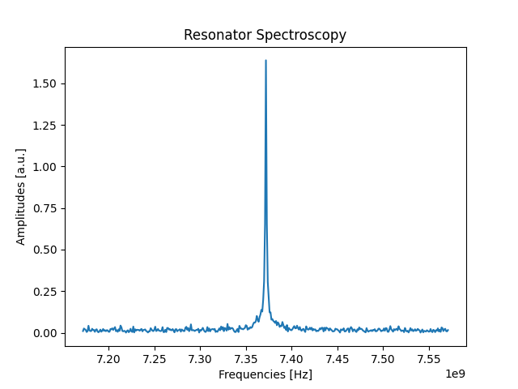

Calibration experiments
=======================

Let's see some examples of the typical experiments needed to calibrate and characterize a qubit.

.. note::
   This is just for demonstration purposes! In the qibo framework these experiments are already coded and available in the ``qibocal`` API.

Let's consider a platform called `single_qubit` with, as expected, a single qubit.

Resonator spectroscopy
----------------------

The first experiment we conduct is a resonator spectroscopy. The experiments is as follow:

1. A measurement pulse is fired at a specific frequency (pulse on the readout line, followed by an acquisition).
2. We repeat point 1 for different frequencies.
3. We plot the acuired amplitudes, identifing the peak value as the resonator frequency.

We start by initiliazing the platform, that reads the information written in the respective runcard, a sequence composed of only a measurement and a sweeper around the pre-defined frequency.

.. code-block:: python

    import numpy as np

    from qibolab import create_platform
    from qibolab.pulses import PulseSequence
    from qibolab.sweeper import Sweeper, SweeperType, Parameter
    from qibolab.execution_parameters import (
        ExecutionParameters,
        AveragingMode,
        AcquisitionType,
    )

    platform = create_platform("single_qubit")
    sequence = PulseSequence()
    ro_pulse = platform.create_MZ_pulse(qubit=0, start=0)
    sequence.add(ro_pulse)

    sweeper = Sweeper(
        parameter=Parameter.frequency,
        values=np.arange(-2e8, +2e8, 1e6),
        pulses=[ro_pulse],
        type=SweeperType.OFFSET,
    )

We then define the execution paramters and launch the experiment.

.. code-block:: python

    options = ExecutionParameters(
        nshots=1000,
        relaxation_time=50,
        averaging_mode=AveragingMode.CYCLIC,
        acquisition_type=AcquisitionType.INTEGRATION,
    )

    results = platform.sweep(sequence, options, sweeper)

In few seconds, the experiment will be finished and we can proceed to plot it.

.. code-block:: python

    import matplotlib.pyplot as plt

    amplitudes = results[ro_pulse.serial].magnitude
    frequencies = np.arange(-2e8, +2e8, 1e6) + ro_pulse.frequency

    plt.title("Resonator Spectroscopy")
    plt.xlabel("Frequencies [Hz]")
    plt.ylabel("Amplitudes [a.u.]")

    plt.plot(frequencies, plt.amplitudes)

Qubit spectroscopy
------------------

Rabi experiment
---------------

Single shot classification
--------------------------
