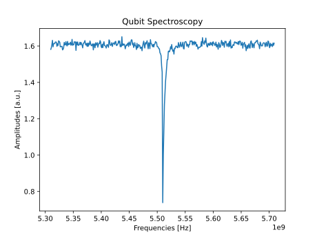
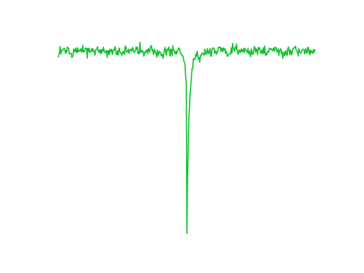
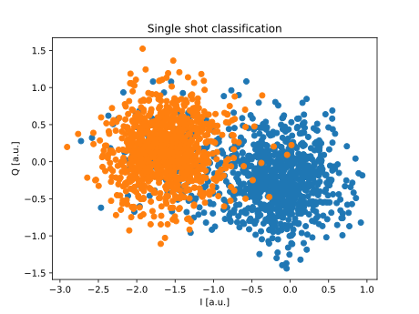
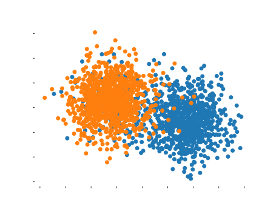

Calibration experiments
=======================

Let's see some examples of the typical experiments needed to calibrate and
characterize a qubit.

.. note::
   This is just for demonstration purposes! In the `Qibo <https://qibo.science/qibo/stable/>`_ framework these experiments are already coded and available in the `Qibocal API <https://qibo.science/qibocal/stable/>`_.

Let's consider a platform called `single_qubit` with, as expected, a single qubit.

Resonator spectroscopy
----------------------

The first experiment we conduct is a resonator spectroscopy. The experiment is
as follows:

1. A measurement pulse (pulse on the readout line, followed by an acquisition)
    is fired at a specific frequency.
2. We repeat point 1 for different frequencies.
3. We plot the acquired amplitudes, identifying the peak/deep value as the
   resonator frequency.

We start by initializing the platform, that reads the information written in the
respective runcard, a sequence composed of only a measurement and a sweeper
around the pre-defined frequency.

.. testcode:: python

    import numpy as np
    from qibolab import create_platform
    from qibolab.sequence import PulseSequence
    from qibolab.sweeper import Sweeper, Parameter
    from qibolab.execution_parameters import (
        ExecutionParameters,
        AveragingMode,
        AcquisitionType,
    )

    # allocate platform
    platform = create_platform("dummy")

    qubit = platform.qubits[0]
    natives = platform.natives.single_qubit[0]
    sequence = natives.MZ()

    # allocate frequency sweeper
    f0 = platform.config(qubit.probe).frequency
    sweeper = Sweeper(
        parameter=Parameter.frequency,
        range=(f0 - 2e8, f0 + 2e8, 1e6),
        channels=[qubit.probe],
    )

We then define the execution parameters and launch the experiment.

.. testcode:: python

    options = ExecutionParameters(
        nshots=1000,
        relaxation_time=50,
        averaging_mode=AveragingMode.CYCLIC,
        acquisition_type=AcquisitionType.INTEGRATION,
    )

    results = platform.execute([sequence], options, [[sweeper]])

In few seconds, the experiment will be finished and we can proceed to plot it.

.. testcode:: python

    import matplotlib.pyplot as plt

    acq = sequence.acquisitions[0][1]
    signal = results[acq.id]
    amplitudes = np.abs(signal[..., 0] + 1j * signal[..., 1])
    frequencies = sweeper.values

    plt.title("Resonator Spectroscopy")
    plt.xlabel("Frequencies [Hz]")
    plt.ylabel("Amplitudes [a.u.]")

    plt.plot(frequencies, amplitudes)
    plt.show()

.. image:: resonator_spectroscopy_light.svg
   :class: only-light
.. image:: resonator_spectroscopy_dark.svg
   :class: only-dark

Qubit spectroscopy
------------------

For a qubit spectroscopy experiment, the procedure is almost identical. A
typical qubit spectroscopy experiment is as follows:

1. A first pulse is sent to the drive line, in order to excite the qubit. Since
   the qubit parameters are not known, this is typically a very long pulse (2
   microseconds) at low amplitude.
2. A measurement, tuned with resonator spectroscopy, is performed.
3. We repeat point 1 for different frequencies of the drive pulse.
4. We plot the acquired amplitudes, identifying the deep/peak value as the qubit
   frequency.

The main difference introduced by this experiment is a slightly more
complex pulse sequence. Therefore with start with that:

.. testcode:: python

    import numpy as np
    import matplotlib.pyplot as plt
    from qibolab import create_platform
    from qibolab.pulses import Pulse, Delay, Gaussian
    from qibolab.sequence import PulseSequence
    from qibolab.sweeper import Sweeper, Parameter
    from qibolab.execution_parameters import (
        ExecutionParameters,
        AveragingMode,
        AcquisitionType,
    )

    # allocate platform
    platform = create_platform("dummy")

    qubit = platform.qubits[0]
    natives = platform.natives.single_qubit[0]

    # create pulse sequence and add pulses
    sequence = PulseSequence()
    sequence |= natives.RX()
    sequence |= natives.MZ()

    # allocate frequency sweeper
    f0 = platform.config(qubit.drive).frequency
    sweeper = Sweeper(
        parameter=Parameter.frequency,
        range=(f0 - 2e8, f0 + 2e8, 1e6),
        channels=[qubit.drive],
    )

Note that the drive pulse has been changed to match the characteristics required
for the experiment.

We can now proceed to launch on hardware:

.. testcode:: python

    options = ExecutionParameters(
        nshots=1000,
        relaxation_time=50,
        averaging_mode=AveragingMode.CYCLIC,
        acquisition_type=AcquisitionType.INTEGRATION,
    )

    results = platform.execute([sequence], options, [[sweeper]])

    acq = sequence.acquisitions[0][1]
    signal = results[acq.id]
    amplitudes = np.abs(signal[..., 0] + 1j * signal[..., 1])
    frequencies = sweeper.values

    plt.title("Qubit Spectroscopy")
    plt.xlabel("Frequencies [Hz]")
    plt.ylabel("Amplitudes [a.u.]")

    plt.plot(frequencies, amplitudes)
    plt.show()

Single shot classification
--------------------------

To avoid seeing other very similar experiment, let's jump to the single shot
classification experiment. The single-shot classification experiment is
conducted towards the end of the single-qubit calibration process and assumes
the availability of already calibrated pulses.

Two distinct pulse sequences are prepared for the experiment:

1. Sequence with only a measurement pulse.
2. Sequence comprising an RX pulse (X gate) followed by a measurement pulse.

For each sequence, the qubit is initialized in state 0 (no operation applied),
and a measurement is executed. This process is repeated multiple times. Unlike
previous experiments, the results of each individual measurement are saved
separately, avoiding averaging. Both measurements are repeated: first with the
single-pulse sequence and then with the two-pulse sequence. The goal is to
compare the outcomes and visualize the differences in the IQ plane between the
two states.

1. Prepare the single-pulse sequence: Measure the qubit multiple times in state
   0.
2. Prepare the two-pulse sequence: Apply an RX pulse followed by measurement,
   and perform the same measurement multiple times.
3. Plotting the Results: Plot the single-shot results for both sequences,
   highlighting the differences in the IQ plane between the two states.

This experiment serves to assess the effectiveness of single-qubit calibration
and its impact on qubit states in the IQ plane.

.. testcode:: python

    import numpy as np
    import matplotlib.pyplot as plt
    from qibolab import create_platform
    from qibolab.pulses import Delay
    from qibolab.sequence import PulseSequence
    from qibolab.sweeper import Sweeper, Parameter
    from qibolab.execution_parameters import (
        ExecutionParameters,
        AveragingMode,
        AcquisitionType,
    )

    # allocate platform
    platform = create_platform("dummy")

    qubit = platform.qubits[0]
    natives = platform.natives.single_qubit[0]

    # create pulse sequence 1
    zero_sequence = natives.MZ()

    # create pulse sequence 2
    one_sequence = PulseSequence()
    one_sequence |= natives.RX()
    one_sequence |= natives.MZ()

    options = ExecutionParameters(
        nshots=1000,
        relaxation_time=50_000,
        averaging_mode=AveragingMode.SINGLESHOT,
        acquisition_type=AcquisitionType.INTEGRATION,
    )

    results = platform.execute([zero_sequence, one_sequence], options)

    acq0 = zero_sequence.acquisitions[0][1]
    acq1 = one_sequence.acquisitions[0][1]

    plt.title("Single shot classification")
    plt.xlabel("I [a.u.]")
    plt.ylabel("Q [a.u.]")
    plt.scatter(
        results[acq1.id][..., 0],
        results[acq1.id][..., 1],
        label="One state",
    )
    plt.scatter(
        results[acq0.id][..., 0],
        results[acq0.id][..., 1],
        label="Zero state",
    )
    plt.show()

Note that in this experiment we passed both sequences in the same ``platform.execute`` command.
In this case the sequences will be unrolled to a single sequence automatically, which is
then deployed with a single communication with the instruments, to reduce communication bottleneck.
