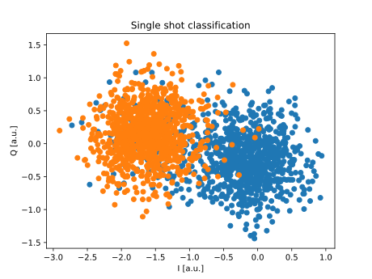

Calibration experiments
=======================

Let's see some examples of the typical experiments needed to calibrate and characterize a qubit.

.. note::
   This is just for demonstration purposes! In the qibo framework these experiments are already coded and available in the ``qibocal`` API.

Let's consider a platform called `single_qubit` with, as expected, a single qubit.

Resonator spectroscopy
----------------------

The first experiment we conduct is a resonator spectroscopy. The experiments is as follow:

1. A measurement pulse is fired at a specific frequency (pulse on the readout line, followed by an acquisition).
2. We repeat point 1 for different frequencies.
3. We plot the acuired amplitudes, identifing the peak/deep value as the resonator frequency.

We start by initiliazing the platform, that reads the information written in the respective runcard, a sequence composed of only a measurement and a sweeper around the pre-defined frequency.

.. code-block:: python

    import numpy as np

    from qibolab import create_platform
    from qibolab.pulses import PulseSequence
    from qibolab.sweeper import Sweeper, SweeperType, Parameter
    from qibolab.execution_parameters import (
        ExecutionParameters,
        AveragingMode,
        AcquisitionType,
    )

    platform = create_platform("single_qubit")
    sequence = PulseSequence()
    ro_pulse = platform.create_MZ_pulse(qubit=0, start=0)
    sequence.add(ro_pulse)

    sweeper = Sweeper(
        parameter=Parameter.frequency,
        values=np.arange(-2e8, +2e8, 1e6),
        pulses=[ro_pulse],
        type=SweeperType.OFFSET,
    )

We then define the execution paramters and launch the experiment.

.. code-block:: python

    options = ExecutionParameters(
        nshots=1000,
        relaxation_time=50,
        averaging_mode=AveragingMode.CYCLIC,
        acquisition_type=AcquisitionType.INTEGRATION,
    )

    results = platform.sweep(sequence, options, sweeper)

In few seconds, the experiment will be finished and we can proceed to plot it.

.. code-block:: python

    import matplotlib.pyplot as plt

    amplitudes = results[ro_pulse.serial].magnitude
    frequencies = np.arange(-2e8, +2e8, 1e6) + ro_pulse.frequency

    plt.title("Resonator Spectroscopy")
    plt.xlabel("Frequencies [Hz]")
    plt.ylabel("Amplitudes [a.u.]")

    plt.plot(frequencies, plt.amplitudes)

.. image:: resonator_spectroscopy.svg

Qubit spectroscopy
------------------

For a qubit spectroscopy experiment, the procedure is almost identical.
A typical qubit spectroscopy experiment is as follows:

1. A first pulse is sent to the drive line, in order to excite the qubit. Since the qubit parameters are not known, this is typically a very long pulse (2 microseconds) at low amplitude.
2. A measurement, tuned with resonator spectroscopy, is performed.
3. We repeat point 1 for different frequencies.
4. We plot the acuired amplitudes, identifing the deep/peak value as the qubit frequency.

So, mainly, the difference that this experiment introduces is a slighlt more complex pulse sequence. Thefore with start with that:

.. code-block:: python

    sequence = PulseSequence()
    dr_pulse = platform.create_RX_pulse(qubit=0, start=0)
    dr_pulse.duration = 2000
    dr_pulse.amplitude = 0.01

    ro_pulse = platform.create_MZ_pulse(qubit=0, start=dr_pulse.finish)

    sequence.add(dr_pulse)
    sequence.add(ro_pulse)

    sweeper = Sweeper(
        parameter=Parameter.frequency,
        values=np.arange(-2e8, +2e8, 1e6),
        pulses=[dr_pulse],
        type=SweeperType.OFFSET,
    )

Note that the drive pulse has been changed to match the characteristics required for the experiment.

We can now proceed to launch on hardware:

.. code-block:: python

    options = ExecutionParameters(
        nshots=1000,
        relaxation_time=50,
        averaging_mode=AveragingMode.CYCLIC,
        acquisition_type=AcquisitionType.INTEGRATION,
    )

    results = platform.sweep(sequence, options, sweeper)

    amplitudes = results[ro_pulse.serial].magnitude
    frequencies = np.arange(-2e8, +2e8, 1e6) + dr_pulse.frequency

    plt.title("Resonator Spectroscopy")
    plt.xlabel("Frequencies [Hz]")
    plt.ylabel("Amplitudes [a.u.]")

    plt.plot(frequencies, plt.amplitudes)

.. image:: qubit_spectroscopy.svg

Single shot classification
--------------------------

To avoid seeing other very similar experiment, let's jump to the single shot classification experiment.
The single-shot classification experiment is conducted towards the end of the single-qubit calibration process and assumes the availability of already calibrated pulses.

Two distinct pulse sequences are prepared for the experiment:

1. Sequence with only a measurement pulse.
2. Sequence comprising an RX pulse (X gate) followed by a measurement pulse.

For each sequence, the qubit is initialized in state 0 (no operation applied), and a measurement is executed. This process is repeated multiple times. Unlike previous experiments, the results of each individual measurement are saved separately, avoiding averaging.
Both measurements are repeated: first with the single-pulse sequence and then with the two-pulse sequence. The goal is to compare the outcomes and visualize the differences in the IQ plane between the two states.

1. Prepare the single-pulse sequence: Measure the qubit multiple times in state 0.
2. Prepare the two-pulse sequence: Apply an RX pulse followed by measurement, and perform the same measurement multiple times.
3. Plotting the Results: Plot the single-shot results for both sequences, highlighting the differences in the IQ plane between the two states.

This experiment serves to assess the effectiveness of single-qubit calibration and its impact on qubit states in the IQ plane.

.. code-block:: python

    one_sequence = PulseSequence()
    dr_pulse = platform.create_RX_pulse(qubit=0, start=0)
    ro_pulse1 = platform.create_MZ_pulse(qubit=0, start=dr_pulse.finish)
    one_sequence.add(dr_pulse)
    one_sequence.add(ro_pulse1)

    zero_sequence = PulseSequence()
    ro_pulse2 = platform.create_MZ_pulse(qubit=0, start=0)
    zero_sequence.add(ro_pulse2)

    options = ExecutionParameters(
        nshots=1000,
        relaxation_time=50_000,
        averaging_mode=AveragingMode.SINGLESHOT,
        acquisition_type=AcquisitionType.INTEGRATION,
    )

    results_one = platform.execute_pulse_sequence(one_sequence, options)
    results_zero = platform.execute_pulse_sequence(zero_sequence, options)

    plt.title("Single shot classification")
    plt.xlabel("I [a.u.]")
    plt.ylabel("Q [a.u.]")
    plt.scatter(
        results_one[ro_pulse1.serial].voltage_i,
        results_one[ro_pulse1.serial].voltage_q,
        label="One state",
    )
    plt.scatter(
        results_zero[ro_pulse2.serial].voltage_i,
        results_zero[ro_pulse2.serial].voltage_q,
        label="Zero state",
    )

