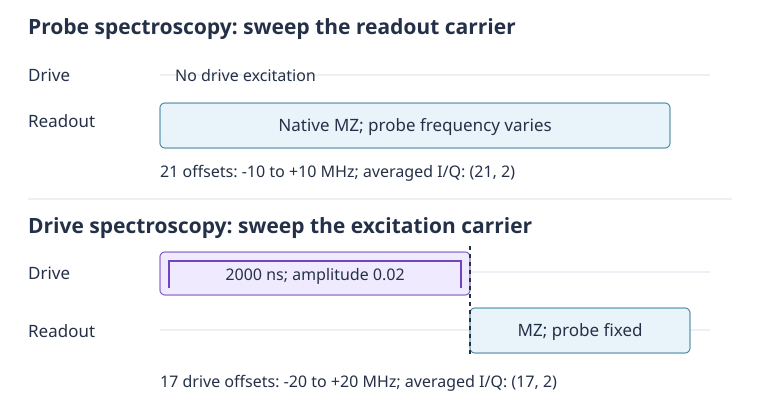
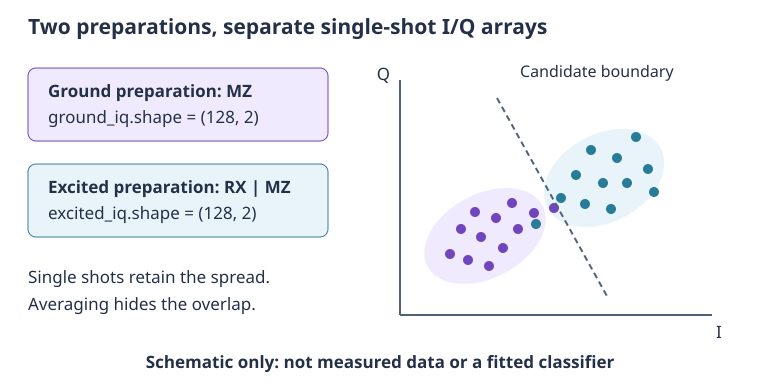

.. _tutorials_calibration:

From experiments to calibration
===============================

Calibration connects an experimental observation to a parameter used in later
experiments. Finding a resonance, for example, is not just a frequency sweep:
you also need to interpret the response, choose a fitted value, and decide
whether to store it as the platform's new operating frequency.

This tutorial shows how to express three common measurements with Qibolab.
It is not a complete calibration procedure. For automated protocols, fitting,
reports, and calibration management, use
`Qibocal <https://qibo.science/qibocal/stable/>`_. Qibolab supplies the execution
interface on which those procedures depend.

The examples run on ``dummy`` so that you can inspect their structure without
hardware. Its random outputs contain no resonance or state information. To
collect meaningful data, replace ``dummy`` with a calibrated laboratory platform
and choose safe ranges for your device. A numerical model is another option,
but it must support the particular experiment; see :doc:`emulator`.

Common setup
------------

We will use integrated I/Q data for spectroscopy and retain individual shots
for the readout comparison:

.. testcode::

    import numpy as np
    from qibolab import (
        AcquisitionType,
        AveragingMode,
        Parameter,
        Pulse,
        PulseSequence,
        Rectangular,
        Sweeper,
        create_platform,
    )

    platform = create_platform("dummy")
    qubit_id = 0
    qubit = platform.qubits[qubit_id]
    natives = platform.natives.single_qubit[qubit_id]

The frequency configurations are in hertz. Pulse lengths and relaxation times
are in nanoseconds. A sweep changes a parameter during execution; it does not
write a calibration back to the platform.

Probe-frequency spectroscopy
----------------------------

A probe-frequency sweep measures the readout response while varying the
carrier frequency of the probe channel. We use the platform's native measurement
as the sequence, and sweep around its current frequency. The small range here
is illustrative, not a recommended search range for an unknown resonator.

.. testcode::

    readout_sequence = natives.MZ()
    probe_frequency = platform.config(qubit.probe).frequency
    probe_sweep = Sweeper(
        parameter=Parameter.frequency,
        channels=[qubit.probe],
        values=probe_frequency + np.linspace(-10e6, 10e6, 21),
    )

    platform.connect()
    try:
        results = platform.execute(
            [readout_sequence],
            sweepers=[[probe_sweep]],
            nshots=64,
            acquisition_type=AcquisitionType.INTEGRATION,
            averaging_mode=AveragingMode.CYCLIC,
        )
    finally:
        platform.disconnect()

    readout_id = readout_sequence.acquisitions[0][1].id
    probe_iq = results[readout_id]
    assert probe_iq.shape == (21, 2)
    probe_response = probe_iq[:, 0] + 1j * probe_iq[:, 1]
    probe_magnitude = np.abs(probe_response)
    probe_phase = np.unwrap(np.angle(probe_response))

Cyclic averaging removes the shot axis, leaving one I/Q pair per frequency.
We form a complex response from those two components. Magnitude and phase
can both be informative: depending on the readout arrangement, a resonance
can appear as a peak, a dip, or a phase change. Selecting the largest sample
is not a general substitute for fitting the appropriate response model.

If Matplotlib is available, inspect the magnitude as follows:

.. code-block:: python

    import matplotlib.pyplot as plt

    plt.plot(probe_sweep.values / 1e9, probe_magnitude)
    plt.xlabel("Probe frequency [GHz]")
    plt.ylabel("Integrated magnitude [a.u.]")
    plt.show()

For dummy data this plot is noise. Do not extract a calibration from it.

Drive-frequency spectroscopy
----------------------------

Qubit spectroscopy adds a drive pulse before the readout and varies the drive
frequency. A relatively long, weak pulse can reveal a transition even before
a pi pulse has been calibrated. Its amplitude and duration must be chosen for
the device: neither an arbitrary amplitude nor a native pi pulse is universally
suitable for spectroscopy.

We explicitly construct such a pulse rather than claiming that a native gate
has already been modified:

.. testcode::

    spectroscopy_pulse = Pulse(
        duration=2000,
        amplitude=0.02,
        envelope=Rectangular(),
    )
    drive_sequence = PulseSequence([(qubit.drive, spectroscopy_pulse)])
    spectroscopy_sequence = drive_sequence | natives.MZ()

    drive_frequency = platform.config(qubit.drive).frequency
    drive_sweep = Sweeper(
        parameter=Parameter.frequency,
        channels=[qubit.drive],
        values=drive_frequency + np.linspace(-20e6, 20e6, 17),
    )

    platform.connect()
    try:
        results = platform.execute(
            [spectroscopy_sequence],
            sweepers=[[drive_sweep]],
            nshots=64,
            acquisition_type=AcquisitionType.INTEGRATION,
            averaging_mode=AveragingMode.CYCLIC,
        )
    finally:
        platform.disconnect()

    spectroscopy_id = spectroscopy_sequence.acquisitions[0][1].id
    spectroscopy_iq = results[spectroscopy_id]
    assert spectroscopy_iq.shape == (17, 2)
    spectroscopy_response = spectroscopy_iq[:, 0] + 1j * spectroscopy_iq[:, 1]

The ``|`` composition ensures that readout follows excitation even though the
operations use different channels. The probe frequency remains at its configured
value; only the drive frequency is swept. In a real calibration workflow, the
probe frequency and readout pulse should already give a usable state-dependent
response.

The measured observable is still an integrated readout response, not a direct
measurement of the drive waveform or an automatically inferred excited-state
probability. Turning it into a population estimate requires a readout calibration.
The :doc:`sweep tutorial <sweeps>` explains how to extend this to a
frequency-amplitude grid.

    Two spectroscopy experiments, two different sweep targets. The diagrams
    show sequence stages rather than exact native readout timing. The offsets
    and result shapes match the examples; neither scan automatically fits or
    saves a resonance.

Compare single-shot readout clouds
----------------------------------

Once a state-preparation pulse is calibrated, compare readouts with and without
that pulse. Preserve individual I/Q samples: averaging would discard the
distribution needed to estimate a classifier.

.. testcode::

    ground = natives.MZ()
    excited = natives.RX() | natives.MZ()

    platform.connect()
    try:
        results = platform.execute(
            [ground, excited],
            nshots=128,
            acquisition_type=AcquisitionType.INTEGRATION,
            averaging_mode=AveragingMode.SINGLESHOT,
        )
    finally:
        platform.disconnect()

    ground_iq = results[ground.acquisitions[0][1].id]
    excited_iq = results[excited.acquisitions[0][1].id]
    assert ground_iq.shape == excited_iq.shape == (128, 2)

These are two independent sequences in one execution request, not two readouts
within a single shot of one sequence. Each sequence has its own acquisition
identifier. Hardware support determines whether batching reduces communication
overhead; do not assume that a list of sequences is one contiguous pulse program.

On hardware, plot both arrays in the I/Q plane as in the
:ref:`first experiment <first_experiment>`. Cluster separation can inform the
choice of integration weights, rotation angle, and discrimination threshold.
It does not by itself prove a particular fidelity: state preparation errors,
relaxation during readout, and classifier evaluation all matter. The dummy
platform produces random data for both preparations, so it cannot demonstrate
this separation.

    Why retain single shots: a mean I/Q pair hides the cloud's spread and
    overlap. These points and the candidate boundary are illustrative only,
    not dummy data, measured fidelity, or a fitted classifier.

Apply and persist a calibration deliberately
--------------------------------------------

Keep measurement and parameter changes separate. First evaluate a candidate
with a temporary configuration update:

.. code-block:: python

    # fitted_frequency is obtained from analysis of physical measurement data.
    sequence = natives.MZ()
    platform.connect()
    try:
        confirmation = platform.execute(
            [sequence],
            updates=[{qubit.probe: {"frequency": fitted_frequency}}],
            acquisition_type=AcquisitionType.INTEGRATION,
            averaging_mode=AveragingMode.CYCLIC,
        )
    finally:
        platform.disconnect()

``updates`` affects that execution's configuration, leaving the stored platform
parameters unchanged. Once you accept a calibration, change the in-memory
parameters explicitly:

.. code-block:: python

    platform.update({f"configs.{qubit.probe}.frequency": fitted_frequency})

An in-memory update is still not a disk write. Use the persistence workflow in
:doc:`storage` to save it to an appropriate destination, preferably preserving
the previous calibration. Native pulse calibrations belong in
``parameters.native_gates`` rather than in the channel frequency configuration;
:doc:`lab` explains how those parts fit together.
