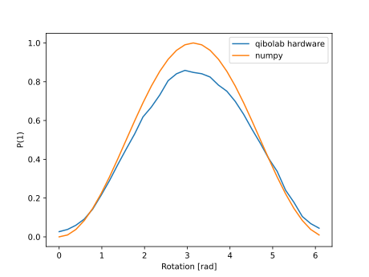
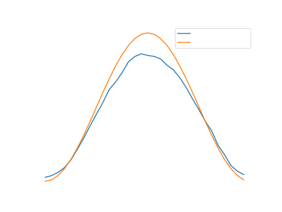

.. _tutorials_circuits:

Circuit execution
=================

Qibolab can be used as a ``qibo`` backend for executing circuits. The purpose
of this section is to show how to do it, without entering into the details of
circuits definition that we leave to the `Qibo
<https://qibo.science/qibo/stable/>`_ documentation.

.. literalinclude:: ./includes/circuits/circuits0.py

In this snippet, we first define a single-qubit circuit containing a single Hadamard gate and a measurement.
We then proceed to define the qibo backend as ``qibolab`` using the ``tii1q_b1`` platform.
Finally, we change the backend to ``numpy``, a simulation one, to compare the results with ideality.
At the end of the script we can inpsect our printed our results:

.. testoutput:: python
    :options: +NORMALIZE_WHITESPACE

    Qibolab: P(0) = 0.49    P(1) = 0.51
    Numpy:   P(0) = 0.50    P(1) = 0.50

..
    TODO: See https://github.com/qiboteam/qibolab/issues/828
          and https://github.com/qiboteam/qibolab/pull/807

Clearly, we do not expect the results to be exactly equal due to the non
ideality of current NISQ devices.

.. note::
   Qibo circuits and gates are backend agnostic. The same circuit can be
   executed on multiple backends, including simulation and quantum platforms.

A slightly more complex circuit, a variable rotation, will produce similar
results:

.. literalinclude:: ./includes/circuits/circuits1.py

Returns the following plot:

.. note::
   Executing circuits using the Qibolab backend results to automatic application of the compilation pipeline (:ref:`main_doc_compiler`) which convert the circuit to a pulse sequence that is executed by the given platform.
   It is possible to modify these pipelines following the instructions in the :ref:`tutorials_compiler` example.

QASM Execution
--------------

Qibolab also supports the execution of circuits starting from a QASM string. The QASM circuit:

..
    TODO: The OpenQASM code below does not correspond to the code above, I think.

.. testcode::

   circuit = """// Generated by QIBO 0.2.4
   OPENQASM 2.0;
   include "qelib1.inc";
   qreg q[3];
   creg a[2];
   cz q[0],q[2];
   gpi2(0.3) q[1];
   cz q[1],q[2];
   measure q[0] -> a[0];
   measure q[2] -> a[1];"""

can be executed by passing it together with the platform name to the :func:`qibolab.execute_qasm` function:

.. testcode::

   from qibolab import execute_qasm

   result = execute_qasm(circuit, platform="dummy")

The return type of :func:`qibolab.execute_qasm` is `qibo.result.MeasurementOutcome`.
See `Qibo API <https://qibo.science/qibo/stable/api-reference>`_ for more details.

C-API
-----

Qibolab also supports the execution of circuits starting from a QASM string using a C-API.
Please refer to the `C-API documentation <https://github.com/qiboteam/qibolab/tree/main/capi>`_.
