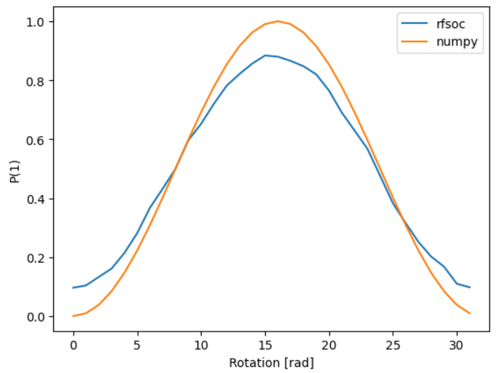

Circuit execution
=================

Qibolab can be used as a ``qibo`` backend for executing executions.
The purpose of this section is to show how to do it, without entering into the details of circuits definition that we leave to the qibo documentation.

.. code-block:: python

    import qibo
    from qibo import models, gates

    def execute_H():
        circuit = models.Circuit(1)

        circuit.add(gates.H(0))
        circuit.add(gates.M(0))

        state = circuit.execute(nshots=5000)
        p0, p1 = state.probabilities(qubits=(0,))
        return round(p0, 2), round(p1, 2)

    qibo.set_backend("qibolab", "tii1q_b1")
    hardware = execute_H()
    qibo.set_backend("numpy")
    simulation = execute_H()

In this snippet, we first define a function to facilitate the circuit definition, in this case of a simple Hadamard gate.
We then proceed to define the qibo backend as ``qibolab`` and, in particular, using the ``tii1q_b1`` platform.
Finally, we change the backend to ``numpy``, a simulation one, to compare the results with ideality.
After executing the script we can print our results that will appear more or less as:

.. code-block:: python

    print(f"P(0) = {hardware[0]}\tP(1) = {hardware[1]}")
    print(f"P(0) = {simulation[0]}\tP(1) = {simulation[1]}")

.. code-block:: text

    > P(0) = 0.54	P(1) = 0.46
    > P(0) = 0.5 	P(1) = 0.4

Clearly, we do not expect the results to be exactly equal due to the non ideality of current NISQ devices.

A slighlty more complex circuit, a variable rotation, will produce similar results:

.. code-block:: python

    def execute_rotation():
        circuit = models.Circuit(1)

        circuit.add(gates.RX(0, theta=0))
        circuit.add(gates.M(0))

        exp_angles = np.arange(0, 2 * np.pi, np.pi / 16)

        res = []

        for angle in exp_angles:
            circuit.set_parameters([angle])
            state = circuit.execute(nshots=4000)
            p0, p1 = state.probabilities(qubits=(0,))

            res.append(p1)
        return res

    qibo.set_backend("qibolab", "tii1q_b1")
    hardware = execute_rotation()
    qibo.set_backend("numpy")
    simulation = execute_rotation()

    plt.plot(hardware, label="rfsoc")
    plt.plot(simulation, label="numpy")

    plt.legend()
    plt.ylabel("P(1)")
    plt.xlabel("Rotation [rad]")

