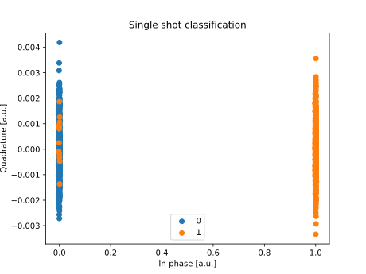

How to emulate a QPU using Qibolab?
===================================

We will use a platform which is also available at
https://github.com/qiboteam/qibocal/tree/main/platforms/qubit, but here it will be
completely reproduced.

In this section we are going to explain how to setup a platform for pulse emulation
and how to use it in Qibolab. To setup a platform we first recommend to have a look at
:ref:`tutorial_platform`.

We are now going to explain a few distinctive features of an emulation
platform. All parameters related to the Hamiltonian to be simulated are coded directly in the JSON file under
the section ``configs``. Here is an example

.. collapse:: Parameters dictionary

    .. testcode::  python

        parameters = {
            "settings": {"nshots": 1024, "relaxation_time": 0},
            "configs": {
                "emulator/bounds": {
                    "kind": "bounds",
                    "waveforms": 1000000,
                    "readout": 50,
                    "instructions": 200,
                },
                "hamiltonian": {
                    "transmon_levels": 2,
                    "single_qubit": {
                        "0": {
                            "frequency": 5e9,
                            "sweetspot": 0.02,
                            "anharmonicity": -200e6,
                            "asymmetry": 0.0,
                            "t1": {"0-1": 1000},
                            "t2": {"0-1": 1900},
                        }
                    },
                    "kind": "hamiltonian",
                },
                "0/drive": {
                    "kind": "drive-emulator",
                    "frequency": 5e9,
                    "scale_factor": 0.1591549,
                },
                "0/drive12": {
                    "kind": "drive-emulator",
                    "frequency": 4.8e9,
                    "scale_factor": 0.1591549,
                },
                "0/flux": {"kind": "flux-emulator", "offset": 0.02},
                "0/probe": {"kind": "iq", "frequency": 5200000000.0},
                "0/acquisition": {
                    "kind": "acquisition",
                    "delay": 0.0,
                    "smearing": 0.0,
                    "threshold": 0.0,
                    "iq_angle": 0.0,
                    "kernel": None,
                },
            },
            "native_gates": {
                "single_qubit": {
                    "0": {
                        "RX": [
                            [
                                "0/drive",
                                {
                                    "duration": 40,
                                    "amplitude": 0.1594,
                                    "envelope": {"kind": "gaussian", "rel_sigma": 0.2},
                                    "relative_phase": 0.0,
                                    "kind": "pulse",
                                },
                            ]
                        ],
                        "RX90": [
                            [
                                "0/drive",
                                {
                                    "duration": 40,
                                    "amplitude": 0.07975,
                                    "envelope": {"kind": "gaussian", "rel_sigma": 0.2},
                                    "relative_phase": 0.0,
                                    "kind": "pulse",
                                },
                            ]
                        ],
                        "MZ": [
                            [
                                "0/acquisition",
                                {
                                    "kind": "readout",
                                    "acquisition": {"kind": "acquisition", "duration": 100.0},
                                    "probe": {
                                        "duration": 100.0,
                                        "amplitude": 0.1,
                                        "envelope": {"kind": "gaussian", "rel_sigma": 0.2},
                                        "relative_phase": 0.0,
                                        "kind": "pulse",
                                    },
                                },
                            ]
                        ],
                        "CP": None,
                    }
                }
            },
        }

We are defining an Hamiltonian with a transmon with two-levels, with a frequency of :math:`\omega_q / 2 \pi = 5 \ \text{GHz}` and
anharmoncity :math:`\alpha/2 \pi = - 200 \ \text{MHz}`,
with :math:`T_1 = 1 \  \mu s` and :math:`T_2 = 1.9 \ \mu s`.
Currently the transmon is flux-tunable since we provided both the sweetspot and the asymmetry parameters in the qubit section and we have also introduce
a flux channel. By removing them the simulation can be performed with a fixed-frequency transmon.
Everything else follows the usual Qibolab conventions. Keep in mind that you still need to define also a readout pulse even if all
parameters ignored in the current emulator except when the readout pulse is played.

We are now going to give an example on how to setup the `platform.py` file.

.. testcode::  python

    from qibolab import ConfigKinds, DcChannel, IqChannel, Platform, Qubit, Hardware
    from qibolab.instruments.emulator import (
        DriveEmulatorConfig,
        EmulatorController,
        FluxEmulatorConfig,
        HamiltonianConfig,
    )

    ConfigKinds.extend([HamiltonianConfig, DriveEmulatorConfig, FluxEmulatorConfig])

    def create() -> Hardware:
        """Create emulator platform with flux-tunable qubit."""
        qubits = {}
        channels = {}

        for q in range(1):
            qubits[q] = qubit = Qubit.default(q)
            channels |= {
                qubit.drive: IqChannel(mixer=None, lo=None),
                qubit.flux: DcChannel(),
            }

        # register the instruments
        instruments = {
            "emulator": EmulatorController(address="0.0.0.0", channels=channels),
        }

        return Hardware(instruments=instruments, qubits=qubits)

.. note::

    Split the following, sourcing from an external file - to avoid duplication with
    :doc:`../getting-started/experiment`.

.. testcode:: python

    from qibolab import Parameters, Platform

    params = Parameters.model_validate(parameters)
    platform = Platform(name="my_platform", parameters=params, **vars(create()))

.. testcode:: python

    import matplotlib.pyplot as plt

    from qibolab import AcquisitionType

    # access the native gates
    gates = platform.natives.single_qubit[0]

    results = []
    # iterate over pulse sequences
    for sequence in [gates.MZ(), gates.RX() | gates.MZ()]:
        # perform the experiment using specific options
        signal = platform.execute(
            [sequence],
            nshots=1000,
            acquisition_type=AcquisitionType.INTEGRATION,
        )
        _, acq = next(iter(sequence.acquisitions))

        # collect the results
        sig = signal[acq.id]
        results.append([sig[..., 0], sig[..., 1]])

    plt.title("Single shot classification")
    plt.xlabel("In-phase [a.u.]")
    plt.ylabel("Quadrature [a.u.]")
    plt.xlim(-0.2, 1.2)
    plt.ylim(-0.7, 0.7)

    plt.scatter(*results[0], label="0")
    plt.scatter(*results[1], label="1")
    plt.legend()

