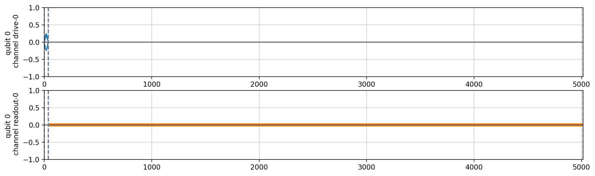
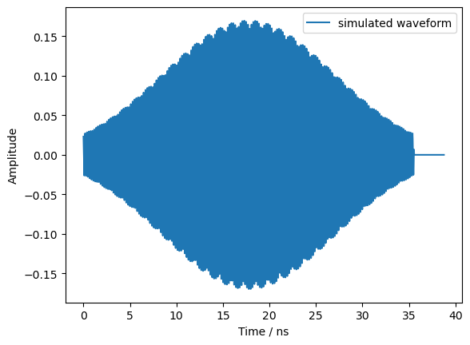
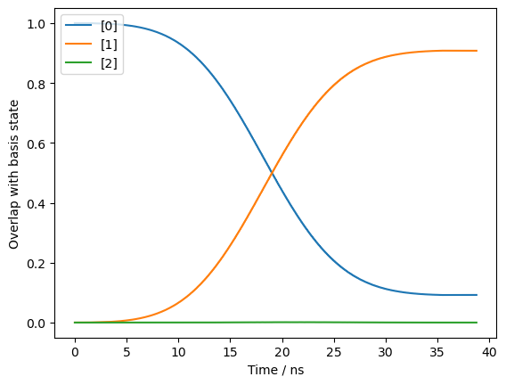

.. _tutorials_emulator:

How to use an emulator?
=======================
Basic Emulator Setups
---------------------

This tutorial will guide you through the process of setting up a one-qubit emulator using the QuTiP backend and showcase some of its features.

First, we need to import the necessary modules. The main module we need is `create_oneQ_emulator` from `qibolab.oneQ_emulator`:

.. code-block:: python

    from qibolab.oneQ_emulator import create_oneQ_emulator

Next, as with all platform create methods in Qibolab, we need the location of the folder containing the runcard that we would like to use. In this tutorial, we will use the demonstration runcard provided ("default_q0") with the emulator:

.. code-block:: python
    from qibolab.instruments.simulator import emulator_test

    runcard_folder = f"{emulator_test.__path__[0]}/default_q0"

Now, we can create the emulator using the `create_oneQ_emulator` function and the runcard folder:

.. code-block:: python

    emulator_platform = create_oneQ_emulator(runcard_folder)

The emulator platform includes a pulse simulator, which we can access like this:

.. code-block:: python

    pulse_simulator = emulator_platform.instruments["pulse_simulator"]

Finally, we can access the simulation backend of the pulse simulator.

.. code-block:: python

    simulation_backend = pulse_simulator.simulation_backend

Execute a Pulse Sequence with an Emulator
-----------------------------------------

This tutorial guides you through executing a pulse sequence with a one-qubit emulator using the QuTiP backend. We will first need to construct the pulse sequence we would like to run. This step is exactly the same as any other Qibolab platform. To keep this tutorial concise, we will construct a pulse sequence using the native gate  pulses from the platform that are specified in the runcard. A pulse sequence is a series of pulses that will be sent to the qubit.

We first import the `PulseSequence` object from `qibolab.pulses` and initialize an instance.

.. code-block:: python

    from qibolab.pulses import PulseSequence

    sequence = PulseSequence()

Now, we retreive the native RX pulse and readout pulse of qubit 0 and add them to the pulse sequence.

.. code-block:: python

    pulse_x0 = emulator_platform.create_RX_pulse(qubit=0, start=0)
    pulse_r0 = emulator_platform.create_qubit_readout_pulse(qubit=0, start=(170 / 4.5))

    sequence.add(pulse_x0)
    sequence.add(pulse_r0)

We can plot the sequence to inspect it.

.. code-block:: python

    sequence.plot()

Next we import the module `ExecutionParameters` from `qibolab.execution_parameters` which is required as an input to the `execute_pulse_sequence` method of any Qibolab platform. The value of `ExecutionParameters.acquisition_type` set to `AcquisitionType.DISCRIMINATION` from `qibolab.execution_parameters` by default is the only option currently supported by the emulator. Let us execute the pulse sequence with 1000 shots.

.. code-block:: python

    from qibolab.execution_parameters import ExecutionParameters

    options = ExecutionParameters(nshots=1000)
    results = emulator_platform.execute_pulse_sequence(sequence, options=options)

Note that for Qibolab device platforms, analogues of the following instrument methods have to be run prior to executing pulse sequence. These methods for the pulse simulator instrument are only kept for consistency and do not have any functionality.

.. code-block:: python

    emulator_platform.instruments["pulse_simulator"].connect()
    emulator_platform.instruments["pulse_simulator"].setup()
    emulator_platform.instruments["pulse_simulator"].start()

Likewise, for Qibolab device platforms, analogues of the following instrument methods have to be run after using the device. These methods for the pulse simulator instrument are only kept for consistency and do not have any functionality.

.. code-block:: python

    emulator_platform.instruments["pulse_simulator"].stop()
    emulator_platform.instruments["pulse_simulator"].disconnect()

Once the simulation is complete, it returns the same result object as any other Qibolab device platform. We can therefore retrieve these results in the same way:

.. code-block:: python

    results[list(results.keys())[1]].samples

We can also print the simulation details.

.. code-block:: python

    emulator_platform.instruments["pulse_simulator"].print_sim_details()

Each time a pulse sequence is simulated by the emulator, the pulse sequence and channel waveforms are added to their respective histories stored in the pulse simulator. Let us retrive the pulse sequence and channel waveform for the pulse sequence that we just executed. The full list of time steps simulated is recorded as part of the channel waveforms data.

.. code-block:: python

    pulse_sequence = pulse_simulator.pulse_sequence_history[-1]
    channel_waveforms = pulse_simulator.channel_waveforms_history[-1]
    full_time_list = channel_waveforms["time"]

We can also plot the simulated waveforms of the drive channel, in this case for qubit 0 (labelled "D-0"):

.. code-block:: python

    import matplotlib.pyplot as plt

    plt.plot(
        channel_waveforms["time"],
        channel_waveforms["channels"]["D-0"],
        label="simulated waveform",
    )
    plt.xlabel("Time / ns")
    plt.ylabel("Amplitude")
    plt.legend()

Similarly, the simulation backend stores the history of states generated for each pulse sequence simulated. We can retrieve the states obtained at every time step of the simulation for the pulse sequence that we just executed as follows:

.. code-block:: python

    psi_t_list = simulation_backend.pulse_sim_history[-1]

Finally, we can check how the fidelity of the state with all computation basis states evolves throughout the simulation to understand evolution of the qubit quantum states. In this simulation, our model also accounted for the second excited state of the qubit.

.. code-block:: python

    simulation_backend.fidelity_history()

