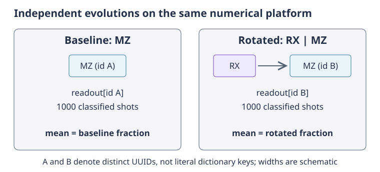

.. _tutorials_emulator:

Running an emulated experiment
==============================

The built-in dummy platform is useful for checking an application's execution
path, but cannot tell us whether a pulse excites a qubit. In this tutorial we
instead load a supplied numerical platform and compare a readout with and without
a preceding native rotation. The same sequence construction and acquisition
handling can later be used with a calibrated laboratory platform.

The examples in this page require optional dependencies and a platform
repository. They are ordinary Python code blocks rather than unconditional
documentation tests: execution performs numerical simulation, and a configured
platform must be supplied separately. No simulation-driver construction or
configuration is needed in this workflow.

Install and locate a platform
-----------------------------

For pulse experiments, install ``qibolab[emulator]``. If you also want to run the
final circuit example, install both the emulator and backend extras:

.. code-block:: console

    pip install "qibolab[backend,emulator]"

Use a configured numerical platform supplied by your platform repository. For
this example, suppose its directory is named ``my_emulated_platform`` and it
provides at least one qubit with native ``RX`` and ``MZ`` sequences. Point
``QIBOLAB_PLATFORMS`` at the parent directory before starting Python:

.. code-block:: console

    export QIBOLAB_PLATFORMS="/path/to/your/platforms"

Then load the configured platform by its directory name:

.. code-block:: python

    from qibolab import create_platform

    platform = create_platform("my_emulated_platform")
    assert platform.nqubits >= 1

Replace both the path and ``my_emulated_platform`` with your actual repository
and platform name. The name is not a built-in alias, and installing the emulator
extra does not create that directory. Other than ``dummy``, platform names are
resolved from the configured search paths.

``create_platform("dummy")`` can be substituted to check sequence construction
and result handling without a numerical platform. It cannot validate the
physical conclusions of the experiment: its acquisitions are random test data.
For a runnable dummy circuit walkthrough, see :ref:`tutorials_circuits`.

Construct the two experiments
-----------------------------

Take the selected physical qubit's native gates from the loaded platform. Build
a baseline readout and then a fresh sequence containing a native RX followed by
readout. The concatenation operator ``|`` places the second sequence after the
first. Fresh readouts are important when submitting several sequences together,
because their acquisition identifiers must be unique.

.. code-block:: python

    physical_qubit = next(iter(platform.qubits))
    natives = platform.natives.single_qubit[physical_qubit]
    assert natives.RX is not None
    assert natives.MZ is not None

    baseline = natives.MZ()
    rotated = natives.RX() | natives.MZ()
    sequences = [baseline, rotated]
    acquisitions = [next(iter(sequence.acquisitions))[1] for sequence in sequences]
    assert acquisitions[0].id != acquisitions[1].id

The baseline asks how the model classifies its initial state. The second
experiment asks how the configured native rotation changes that readout.
These are two independent experiments, not two measurements within one
evolution. Their physical meaning depends on the initial state and native
calibrations provided by your numerical platform.

    Compare two independent preparations, not two readouts of one evolution.
    Native widths are schematic. The physical model and calibration determine
    the fractions; no ideal population or mid-sequence collapse is assumed.

Acquire and interpret the shots
-------------------------------

Use discrimination and single-shot averaging to obtain binary data. As with
hardware pulse experiments, connect explicitly and guarantee disconnection.

.. code-block:: python

    from qibolab import AcquisitionType, AveragingMode

    nshots = 1000
    platform.connect()
    try:
        readout = platform.execute(
            sequences,
            nshots=nshots,
            acquisition_type=AcquisitionType.DISCRIMINATION,
            averaging_mode=AveragingMode.SINGLESHOT,
        )
    finally:
        platform.disconnect()

    baseline_shots = readout[acquisitions[0].id]
    rotated_shots = readout[acquisitions[1].id]
    assert baseline_shots.shape == rotated_shots.shape == (nshots,)
    print("Baseline excited fraction:", baseline_shots.mean())
    print("After RX excited fraction:", rotated_shots.mean())

Look up each result with its acquisition identifier, not with the qubit index
or the sequence's list position. The means estimate the fraction of shots
classified as outcome 1. If the supplied platform models ground-state
initialization and a calibrated bit-flip rotation, the baseline should be near
outcome 0 and the native RX should substantially increase the excited fraction.
Do not require exact ideal counts: native calibration, the physical model and
finite-shot sampling determine the result. For a multilevel model, check what
its binary classification includes before identifying outcome 1 with one
particular excited level.

If this were the ``dummy`` platform, changing the pulse program would not cause
a corresponding change in its random acquisitions. The physical dependence is
the reason to use emulation for this experiment.

Request another acquisition representation
------------------------------------------

If your supplied platform supports integration with cyclic averaging, a second
execution can request that representation. For each acquisition the usual
result shape is ``(2,)``, representing I and Q.

.. code-block:: python

    platform.connect()
    try:
        integrated = platform.execute(
            sequences,
            nshots=nshots,
            acquisition_type=AcquisitionType.INTEGRATION,
            averaging_mode=AveragingMode.CYCLIC,
        )
    finally:
        platform.disconnect()

    for name, acquisition in zip(("baseline", "RX"), acquisitions):
        iq = integrated[acquisition.id]
        assert iq.shape == (2,)
        print(name, "averaged I/Q:", iq)

The shape is an interface convention, not a guarantee that a readout chain or
resonator trajectory was simulated. A numerical platform may use I/Q arrays to
represent population proxies, with a zero quadrature component, or supply other
synthetic signals. Consult the interpretation supplied with your platform; do
not automatically treat these pairs as voltages or physical I/Q clusters.

Execute a native circuit on the same platform
---------------------------------------------

With ``qibolab[backend,emulator]`` installed, the platform can also be passed
to Qibo's backend constructor. The backend supplies compilation and manages
the connection lifecycle. A final measurement remains necessary to obtain a
circuit result.

.. code-block:: python

    from qibo import Circuit, construct_backend, gates

    backend = construct_backend("qibolab", platform=platform)
    circuit = Circuit(1, wire_names=[physical_qubit])
    circuit.add(gates.GPI2(0, phi=0.0))
    circuit.add(gates.M(0))

    try:
        outcome = backend.execute_circuit(circuit, nshots=nshots)
    finally:
        platform.disconnect()

    assert outcome.samples().shape == (nshots, 1)
    frequencies = outcome.frequencies()
    print("Measured excited fraction:", frequencies.get("1", 0) / nshots)

``GPI2`` requests a :math:`\pi/2` rotation, so this is a different preparation
from the native RX pulse experiment. Its frequency estimate comes from acquired
shots, not an exact state-vector probability. For larger circuits, first satisfy
the native-gate and mapping requirements in :ref:`main_doc_compiler`.

Keep measurements at the end
----------------------------

These examples use one final acquisition per experiment. Inserting intermediate
readouts is a different physical experiment: it requires a numerical platform
that supports measurement-induced collapse and subsequent conditioned evolution.
Do not infer that capability from the ability to return classified shots.
On several qubits, confirm that the platform samples the joint distribution
before studying correlations. Likewise, verify support before introducing sweeps
that change acquisition timing. See :ref:`main_doc_emulator` for the result
conventions and model capabilities to consider before extending this experiment.
