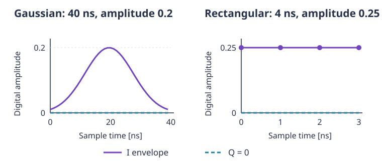
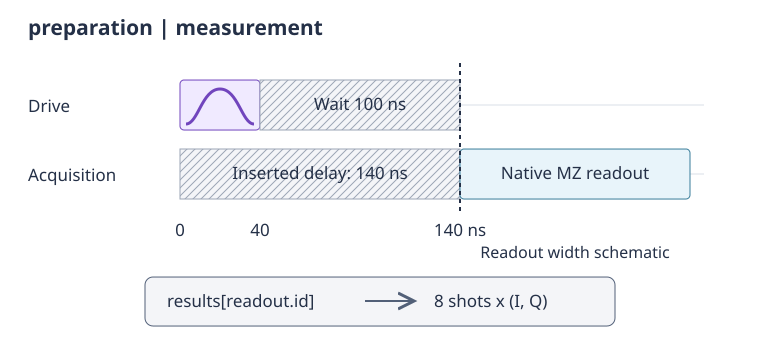

.. _tutorials_pulses:

Pulses execution
================

This tutorial builds an excitation, an idle interval, and a measurement
without compiling a gate circuit. Such a sequence is the starting point
for experiments that ask how a qubit responds to a pulse or how its state
changes during a wait. We will first define a waveform, then check the
schedule, and finally retrieve the measurement by its identifier.

All examples run in order using the built-in dummy platform, so no
hardware or external platform files are required. Its results are random
test data, **not a physical simulation**: changing the pulse or wait here
does not produce meaningful excitation probabilities or relaxation.
The small shot counts and short relaxation times keep the example
lightweight; they are not recommendations for laboratory execution.

Start with the platform's channels
----------------------------------

Channel names belong to the platform. Instead of spelling a drive or
acquisition name ourselves, retrieve the channels of the qubit we want
to address.

.. testcode:: pulses

    import numpy as np

    from qibolab import (
        AcquisitionType,
        AveragingMode,
        Delay,
        Gaussian,
        Pulse,
        PulseSequence,
        Readout,
        Rectangular,
        VirtualZ,
        create_platform,
    )

    platform = create_platform("dummy")
    qubit = platform.qubits[0]
    natives = platform.natives.single_qubit[0]
    assert qubit.drive in platform.channels
    assert qubit.acquisition in platform.channels

The qubit exposes different roles: ``drive`` controls rotations,
``probe`` emits the measurement excitation, and ``acquisition`` receives
the measurement signal. Not every real platform has every kind of
channel. A pulse belongs on an output channel; an acquisition or combined
readout belongs on an acquisition channel.

Define and inspect a waveform
-----------------------------

We choose a 40 ns Gaussian with digital amplitude 0.2. This describes an
output waveform, not a calibrated rotation. ``relative_phase`` is in
radians, and ``rel_sigma`` is the standard deviation as a fraction of the
duration, so 0.2 corresponds here to 8 ns.

.. testcode:: pulses

    excitation = Pulse(
        duration=40,
        amplitude=0.2,
        relative_phase=0.0,
        envelope=Gaussian(rel_sigma=0.2),
    )

    envelopes = excitation.envelopes(sampling_rate=1.0)
    assert envelopes.shape == (2, 40)
    np.testing.assert_allclose(envelopes[1], 0)
    assert 0 < envelopes[0].max() <= excitation.amplitude

Sampling at 1 GS/s gives one sample per ns. The first row is the
in-phase envelope and the second the quadrature envelope. The amplitude
scales both rows; the carrier frequency and relative phase are not
applied by ``envelopes``. For an easily checked comparison, a rectangular
envelope has a constant in-phase component:

.. doctest:: pulses

    >>> square = Pulse(duration=4, amplitude=0.25, envelope=Rectangular())
    >>> square.i(sampling_rate=1.0).tolist()
    [0.25, 0.25, 0.25, 0.25]
    >>> square.q(sampling_rate=1.0).tolist()
    [0.0, 0.0, 0.0, 0.0]

The carrier frequency is configured on ``qubit.drive``, not on
``excitation``. It is in Hz, even though waveform sampling rates are
expressed in GS/s. Before using a custom pulse on hardware, choose its
parameters against the channel's calibration and allowed output range.

    Sampled envelopes for the two pulses above at 1 GS/s. The panels use
    different time and amplitude scales. These are digital envelopes, not
    carrier-modulated signals or measured qubit responses.

Make the measurement wait
-------------------------

Now place the excitation and a 100 ns wait on the same drive channel.
Consecutive entries on that channel are sequential. For measurement we
use the calibrated ``MZ`` factory, which supplies both probe and
acquisition settings.

.. testcode:: pulses

    preparation = PulseSequence(
        [
            (qubit.drive, excitation),
            (qubit.drive, Delay(duration=100)),
        ]
    )
    measurement = natives.MZ()
    sequence = preparation | measurement
    readout = measurement.acquisitions[0][1]

    assert preparation.channel_duration(qubit.drive) == 140
    assert sequence.duration == 140 + measurement.duration
    explicit = sequence.align_to_delays()
    acquisition_events = list(explicit.channel(qubit.acquisition))
    assert isinstance(acquisition_events[0], Delay)
    assert acquisition_events[0].duration == 140
    assert acquisition_events[1].id == readout.id

The ``|`` operator is essential: it starts the measurement stage only
after the preparation ends. The explicit schedule shows the 140 ns
delay inserted on the acquisition channel. ``align_to_delays`` returns a
new sequence and leaves the alignment-based original intact.

    Excite, wait, then measure: the drive preparation ends at 140 ns.
    The native readout is drawn schematically, not to the same time scale;
    its timing comes from the platform's calibration.

By contrast, ordinary list-like addition only appends entries. Since
the native measurement uses a different channel, it would start at time
zero in the following schedule:

.. testcode:: pulses

    overlapping = preparation + measurement
    assert overlapping.channel_duration(qubit.acquisition) == measurement.duration
    assert overlapping.duration == max(140, measurement.duration)

The ``<<`` operator is also not a global boundary: it aligns only the
right-hand sequence's channels at their latest existing time. For this
preparation, which has no acquisition-channel instructions, that would
still start the measurement at zero. Use ``|`` for successive experiment
stages; use ``append`` or ``extend`` for deliberate independent-channel
timing. If only some channels need a common boundary,
``sequence.align(channels)`` synchronizes that selected set.

Execute and retrieve the correct readout
----------------------------------------

Request single-shot integrated data. There are eight repetitions and
one readout, so the result for that readout has eight I/Q pairs.
Connection cleanup belongs in a ``finally`` block so that failures do
not bypass disconnection.

.. testcode:: pulses

    platform.connect()
    try:
        results = platform.execute(
            [sequence],
            nshots=8,
            relaxation_time=100,
            acquisition_type=AcquisitionType.INTEGRATION,
            averaging_mode=AveragingMode.SINGLESHOT,
        )
    finally:
        platform.disconnect()

    iq = results[readout.id]
    assert set(results) == {readout.id}
    print(iq.shape)

.. testoutput:: pulses

    (8, 2)

``iq[:, 0]`` selects I and ``iq[:, 1]`` selects Q. On real hardware,
their interpretation depends on the acquisition calibration. Here we
assert only the layout, because the dummy's random values have no
physical meaning.

The result dictionary is keyed by acquisition identifiers, not qubit
numbers. Our ``readout`` was saved from the measurement that entered the
sequence. A new ``natives.MZ()`` call creates a new acquisition and cannot
be used to look up this result. Calling ``sequence.acquisitions`` is
another way to discover the actual measurement objects, especially
when a native sequence contains more than one readout.

Replace the custom excitation with a native rotation
----------------------------------------------------

If the objective is a known rotation rather than testing a new
waveform, start from the native calibration. ``RX()`` supplies the
calibrated pi rotation, while ``R(theta=..., phi=...)`` constructs a
rotation about an axis in the equatorial plane. Both angles are in
radians; ``phi=0`` chooses the x axis and ``phi=pi/2`` the y axis.
The current ``R`` interface accepts ``0 <= theta < 2*pi``.

.. testcode:: pulses

    half_rotation = natives.R(theta=np.pi / 2, phi=np.pi / 2)
    native_measurement = natives.MZ()
    native_sequence = half_rotation | native_measurement
    native_readout = native_measurement.acquisitions[0][1]
    assert native_readout.id != readout.id

    platform.connect()
    try:
        averaged = platform.execute(
            [native_sequence],
            nshots=8,
            relaxation_time=100,
            acquisition_type=AcquisitionType.INTEGRATION,
            averaging_mode=AveragingMode.CYCLIC,
        )
    finally:
        platform.disconnect()

    assert averaged[native_readout.id].shape == (2,)

Averaging removes the shot axis, leaving one I/Q pair. The rotation
factory uses the platform's available rotation calibration; it should
not be replaced by assuming that any pulse of a chosen duration is a
half rotation.

Fresh factory calls are also important when comparing several
sequences in one execution. Make a separate measurement for each:

.. testcode:: pulses

    reference = natives.MZ()
    excited = natives.RX() | natives.MZ()
    experiments = [reference, excited]
    readouts = [experiment.acquisitions[0][1] for experiment in experiments]
    assert readouts[0].id != readouts[1].id

    platform.connect()
    try:
        populations = platform.execute(
            experiments,
            nshots=8,
            relaxation_time=100,
            acquisition_type=AcquisitionType.DISCRIMINATION,
            averaging_mode=AveragingMode.CYCLIC,
        )
    finally:
        platform.disconnect()

    assert set(populations) == {event.id for event in readouts}
    assert all(populations[event.id].shape == () for event in readouts)

There is no leading axis of length two for these experiments: each
readout has its own dictionary entry. With binary discrimination,
averaged values would estimate populations on hardware. They cannot be
used to compare excitation probabilities on dummy.
Passing ``[reference, reference.copy()]`` instead is invalid because
the shallow copy retains the acquisition identifier. Sequence
composition also preserves identities; use native factory calls or
``instruction.new()`` to make genuinely new instructions.

Change a phase without adding time
----------------------------------

A ``VirtualZ`` instruction changes the drive frame without emitting a
waveform or extending the schedule. In Qibolab's phase convention,
``to_relative_phases`` accumulates these phase changes into subsequent
pulses on the same channel:

.. testcode:: pulses

    phase_sequence = PulseSequence(
        [
            (qubit.drive, VirtualZ(phase=np.pi / 2)),
            (qubit.drive, excitation),
        ]
    )
    embedded = phase_sequence.to_relative_phases()
    assert phase_sequence.duration == excitation.duration
    assert len(embedded) == 1
    assert np.isclose(embedded[0][1].relative_phase, np.pi / 2)
    assert excitation.relative_phase == 0.0

Use a pulse's ``relative_phase`` when only that pulse needs an offset;
use a virtual frame change when the offset should persist for later
pulses. Both are in radians. This conversion illustrates the phase
bookkeeping without claiming that sampled envelopes themselves include
the phase.

Inspect a short raw acquisition
-------------------------------

To see the extra time-sample axis, construct a small readout explicitly.
``Readout.from_probe`` pairs a probe pulse with an acquisition of the
same duration and zero time of flight. It is sufficient for checking
array layout here, but real readout timing and waveform parameters
should normally come from the calibrated measurement.

.. testcode:: pulses

    short_probe = Pulse(duration=16, amplitude=0.1, envelope=Rectangular())
    short_readout = Readout.from_probe(short_probe)
    raw_sequence = PulseSequence([(qubit.acquisition, short_readout)])
    assert short_readout.id == short_readout.acquisition.id

    platform.connect()
    try:
        raw = platform.execute(
            [raw_sequence],
            nshots=4,
            relaxation_time=100,
            acquisition_type=AcquisitionType.RAW,
            averaging_mode=AveragingMode.SINGLESHOT,
        )
    finally:
        platform.disconnect()

    assert raw[short_readout.id].shape == (4, 16, 2)

The dummy platform's sampling rate is 1 GS/s, giving 16 samples for this
16 ns acquisition. The shape is ``(shots, samples, I/Q)``, not
``(I/Q, samples)`` as in a pulse's sampled envelopes. Actual acquisition
sample counts and supported raw modes depend on the platform. Raw data
retain a waveform; do not treat them as already integrated or assume
that they are already demodulated.

You now have the essential loop: construct instructions, verify the
channel timing, retain the measurement identities, and choose an
acquisition mode. The :ref:`experiment guide <main_doc_experiment>`
explains the full result-shape convention. To repeat this experiment
over amplitudes, frequencies, or waits without a Python execution loop,
continue with :ref:`tutorials_sweeps`.
