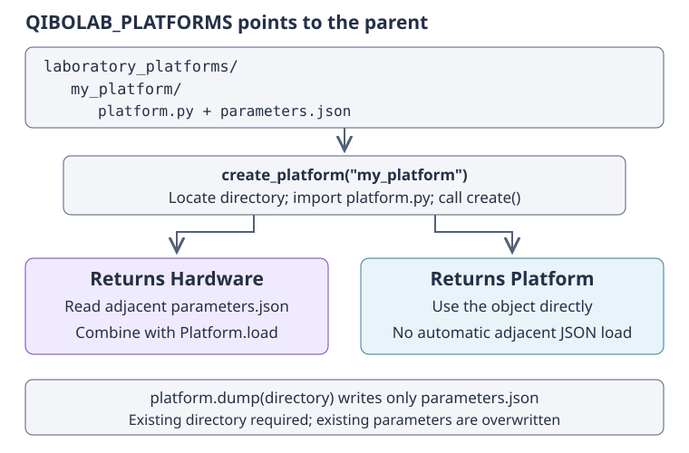

.. _main_doc_storage:

Persisting and discovering platforms
====================================

Parameter persistence and platform discovery solve different problems.
Persistence records operating values so that a later session can reuse them.
Discovery locates and executes a Python factory that supplies the hardware.
Neither is required for :ref:`direct platform construction <tutorial_platform>`,
and serializing parameters in memory does not require an environment variable
(see :ref:`parameters_json`).

Directory persistence
---------------------

The conventional platform directory separates executable construction code from
serializable operating data:

.. code-block:: text

    laboratory_platforms/
        my_platform/
            platform.py
            parameters.json

``platform.py`` defines a zero-argument ``create()`` function returning either
:class:`qibolab.Hardware` or a complete :class:`qibolab.Platform`.
``parameters.json`` holds the ``Parameters`` model: settings, component
configurations, and native sequences. It does not contain instrument objects,
connection state, the platform name, or measurement results.

``platform.dump(path)`` writes ``path / "parameters.json"`` using the current
parameter model. The directory must already exist, and an existing file is
overwritten. It does not generate ``platform.py`` or remember an automatic save
location. Thus neither ``platform.update(...)`` nor ``execute(updates=...)``
saves a calibration on its own.

``Platform.load(path, instruments=..., qubits=..., couplers=...)`` reads that
file and combines it with the supplied hardware mappings. The argument is a
directory ``Path``, not the JSON filename. Unless explicitly overridden, the
loaded platform's name is the directory's final component. This direct loading
method does not use ``QIBOLAB_PLATFORMS`` and does not connect instruments.

The following round trip uses only dummy hardware. Choose an unused directory
for the example; it is removed at the end of this page's example.

.. doctest:: storage

    >>> from pathlib import Path
    >>> from qibolab import Platform, create_platform
    >>> folder = Path("qibolab-storage-example")
    >>> folder.mkdir()
    >>> platform = create_platform("dummy")
    >>> platform.update({"settings.nshots": 8, "configs.0/drive.frequency": 4.3e9})
    >>> platform.dump(folder)
    >>> (folder / "parameters.json").is_file()
    True
    >>> restored = Platform.load(
    ...     folder,
    ...     instruments=platform.instruments,
    ...     qubits=platform.qubits,
    ...     couplers=platform.couplers,
    ...     name="restored",
    ... )
    >>> restored.name, restored.settings.nshots
    ('restored', 8)
    >>> restored.config(restored.qubits[0].drive).frequency
    4300000000.0
    >>> restored.is_connected
    False

Only the parameters were read from disk; the instrument objects above are
reused, not reconstructed or cloned. Keep one owner for their connection
lifecycle. Also retain the hardware definition alongside any archived parameter
version: loading a schema-valid calibration against different wiring can still
be physically incorrect.

Two factory patterns
--------------------

If ``create()`` returns ``Hardware``, the discovery loader combines it with the
adjacent ``parameters.json`` via ``Platform.load``. This is useful when the
hardware construction changes less often than calibration values. In an
external integration, ``create()`` can return the hardware provided by that
integration. To make the example directory discoverable without importing an
individual instrument, write this small dummy-based factory:

.. doctest:: storage

    >>> definition = """from qibolab import create_platform
    ... from qibolab.platform import Hardware
    ... def create():
    ...     existing = create_platform("dummy")
    ...     return Hardware(
    ...         instruments=existing.instruments,
    ...         qubits=existing.qubits,
    ...         couplers=existing.couplers,
    ...     )
    ... """
    >>> _ = (folder / "platform.py").write_text(definition)

If ``create()`` returns a full ``Platform`` instead, ``create_platform`` returns
it directly and does not automatically read an adjacent parameters file.
The factory is responsible for obtaining parameters, whether from a database,
in-memory construction, or an explicit ``Platform.load``. When that factory
chooses the conventional file, anchor it to ``__file__``, not the caller's
working directory. For example, the dummy-only equivalent is:

.. code-block:: python

    # Alternative contents of my_platform/platform.py
    from pathlib import Path
    from qibolab import Platform, create_platform

    def create():
        existing = create_platform("dummy")
        return Platform.load(
            Path(__file__).resolve().parent,
            instruments=existing.instruments,
            qubits=existing.qubits,
            couplers=existing.couplers,
        )

These two patterns are alternatives, not two layers of required loading.
Calling or importing your factory directly is also valid and needs no discovery
configuration.

    Discovery follows one of two factory branches. The environment points
    to the parent directory; ``dump`` writes operating data, not the factory
    or results. Neither loading branch connects instruments.

Environment-based discovery
---------------------------

``create_platform("my_platform")`` searches parent directories listed in
``QIBOLAB_PLATFORMS`` for a child named ``my_platform``, imports that child's
``platform.py``, and calls ``create()``. The environment variable points to the
**parent of platform directories**, not to ``platform.py`` or normally to
``my_platform`` itself. Python factory code is executed during loading, so only
use platform definitions you trust.

For a Unix shell, configure one search root with:

.. code-block:: bash

    export QIBOLAB_PLATFORMS="/path/to/laboratory_platforms"

For PowerShell:

.. code-block:: powershell

    $env:QIBOLAB_PLATFORMS = "C:\laboratory_platforms"

Multiple roots are separated by ``os.pathsep``: ``:`` on Unix and ``;`` on
Windows. Earlier roots take precedence when the same platform name occurs in
more than one location. A portable Python assignment is:

.. code-block:: python

    import os
    from pathlib import Path

    roots = [Path("laboratory_platforms").resolve(), Path("shared_platforms").resolve()]
    os.environ["QIBOLAB_PLATFORMS"] = os.pathsep.join(str(root) for root in roots)

Discovery does not recursively search arbitrary subdirectories or fall back to
the current directory. For non-dummy names, an unset ``QIBOLAB_PLATFORMS``
raises ``RuntimeError``; a name not found in the search roots raises
``ValueError``. The first existing matching path wins, so a broken definition
in an earlier root is not skipped in favor of a later copy.

``"dummy"`` is the only built-in special name handled by ``create_platform``.
It works without this environment variable and does not resolve to a platform
directory in the search roots. Other names need an external definition;
installing Qibolab alone does not register a laboratory platform.

Locating a directory versus loading hardware
--------------------------------------------

:func:`qibolab.platform.locate_platform` returns the matching path without
importing Python code or reading parameters. Its default search uses the
environment roots. Supplying ``paths=[Path(...), ...]`` bypasses the environment
entirely and searches only those roots. The current locator checks that the
matching path exists, not that it contains a valid factory or parameter file.

:func:`qibolab.platform.load_hardware` instead imports ``platform.py`` and calls
``create()``. It requires that the factory return ``Hardware``; a factory
returning ``Platform`` is not accepted. It does not independently load
``parameters.json`` or apply the dummy-name shortcut.

``load_hardware`` accepts a name or a path to a **platform directory**, not a
path to ``platform.py``. It searches the current directory first and then the
environment roots. In the current implementation the environment variable must
be set even when passing an existing absolute or relative directory path:
the environment roots are evaluated before searching. For loading parameters
with an explicitly supplied hardware mapping and no environment requirement,
use ``Platform.load`` instead.

This continuation exercises all three discovery operations with the example
factory. The environment is scoped to the ``with`` block and restored
afterwards; no physical connection is opened.

.. doctest:: storage

    >>> import os
    >>> from unittest.mock import patch
    >>> from qibolab.platform import Hardware, load_hardware, locate_platform
    >>> with patch.dict(os.environ, {"QIBOLAB_PLATFORMS": str(folder.parent.resolve())}):
    ...     located = locate_platform(folder.name)
    ...     hardware = load_hardware(folder.resolve())
    ...     registered = create_platform(folder.name)
    ...
    >>> located == folder.resolve()
    True
    >>> isinstance(hardware, Hardware)
    True
    >>> registered.name, registered.settings.nshots
    ('qibolab-storage-example', 8)
    >>> registered.config(registered.qubits[0].drive).frequency
    4300000000.0

An explicit-root locator also works without the environment:

.. doctest:: storage

    >>> with patch.dict(os.environ):
    ...     _ = os.environ.pop("QIBOLAB_PLATFORMS", None)
    ...     located = locate_platform(folder.name, paths=[folder.parent.resolve()])
    ...
    >>> located == folder.resolve()
    True

Finally, remove the files created by the example:

.. doctest:: storage

    >>> import shutil
    >>> shutil.rmtree(folder)

For a new directory containing a ``Hardware`` factory but no parameter file,
``qibolab.platform.reset_parameters`` can create the initial
``parameters.json``. It uses ``load_hardware`` and therefore has the same
environment requirement and factory restriction. It overwrites an existing
file with uncalibrated defaults, not with a recovered calibration. Review
:ref:`the initialization workflow <tutorial_platform>` before using it, and
back up any existing calibration before resetting it.
